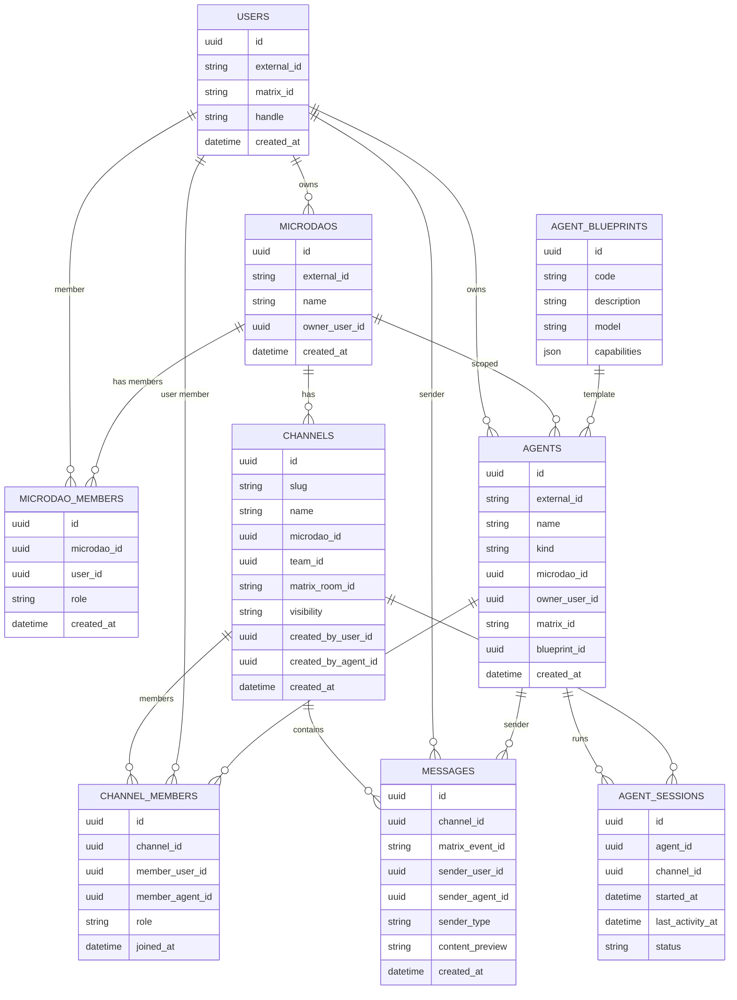
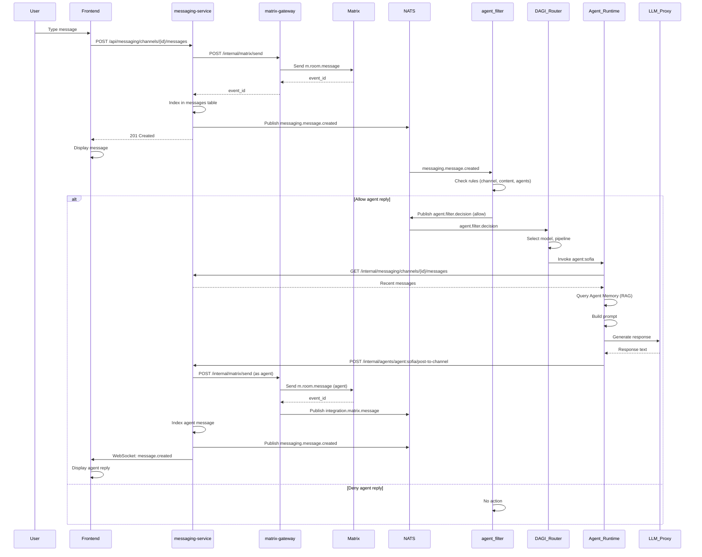
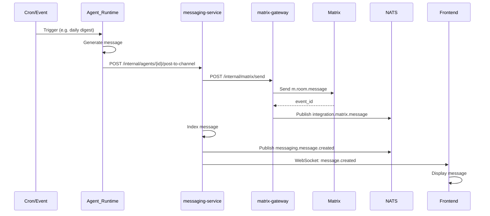

# DAARION Messaging Architecture

**Complete Specification: Messenger + Matrix + Agents + DAGI Router**

**Version:** 1.0.0  
**Date:** 2025-11-24  
**Status:** Production Ready

---

## Table of Contents

1. [Overview](#overview)
2. [System Components](#system-components)
3. [Data Model (ERD)](#data-model-erd)
4. [matrix-gateway API Specification](#matrix-gateway-api-specification)
5. [Message Flow: Human → Agent Reply](#message-flow-human--agent-reply)
6. [Agent-Initiated Messages](#agent-initiated-messages)
7. [agent_filter Rules](#agent_filter-rules)
8. [DAGI Router Integration](#dagi-router-integration)
9. [Sequence Diagrams](#sequence-diagrams)
10. [Implementation Guide](#implementation-guide)

---

## Overview

DAARION Messaging Architecture побудована на Matrix protocol з повною інтеграцією агентів через DAGI Router.

### Key Principles

1. **Matrix as Source of Truth** — повідомлення зберігаються в Matrix, DAARION тримає індекс
2. **Agent-Aware** — агенти як повноцінні учасники каналів
3. **Event-Driven** — всі дії через NATS JetStream
4. **Security First** — agent_filter контролює доступ агентів
5. **Element Compatible** — повна сумісність з Element та іншими Matrix клієнтами

### Architecture Layers

```
┌─────────────────────────────────────────────────────────┐
│                   Frontend (React)                      │
│              MessengerPage + WebSocket                  │
└────────────────────┬────────────────────────────────────┘
                     │
                     ▼
┌─────────────────────────────────────────────────────────┐
│              messaging-service (FastAPI)                │
│         REST API + WebSocket + Channel Management       │
└────────────────────┬────────────────────────────────────┘
                     │
       ┌─────────────┴─────────────┐
       │                           │
       ▼                           ▼
┌──────────────┐         ┌──────────────────┐
│ matrix-gateway│         │   NATS JetStream │
│  (Internal)  │         │   Event Bus      │
└──────┬───────┘         └────────┬─────────┘
       │                          │
       ▼                          ▼
┌──────────────┐         ┌──────────────────┐
│    Matrix    │         │  agent_filter    │
│  Homeserver  │         │  DAGI Router     │
│  (Synapse)   │         │  Agent Runtime   │
└──────────────┘         └──────────────────┘
```

---

## System Components

### 1. messaging-service
- **Role:** DAARION-specific messaging API
- **Port:** 7004
- **Responsibilities:**
  - Channel CRUD (mapped to Matrix rooms)
  - Message indexing (full content in Matrix)
  - Member management
  - WebSocket real-time updates
  - Agent posting endpoint

### 2. matrix-gateway
- **Role:** Internal Matrix API adapter
- **Port:** 7003 (internal only)
- **Responsibilities:**
  - Create/manage Matrix rooms
  - Send messages on behalf of users/agents
  - Receive Matrix events via webhook
  - Normalize Matrix ↔ DAARION entities
  - Publish to NATS

### 3. agent_filter
- **Role:** Security and routing layer
- **Responsibilities:**
  - Validate agent access to channels
  - Apply content policies
  - Decide which agents can reply
  - Route to DAGI Router

### 4. DAGI Router
- **Role:** Agent orchestration
- **Responsibilities:**
  - Select model for agent
  - Choose pipeline (Memory, Tools, etc.)
  - Invoke Agent Runtime
  - Track agent sessions

### 5. Agent Runtime
- **Role:** Execute agent logic
- **Responsibilities:**
  - Read channel context
  - Query Agent Memory (RAG)
  - Call LLM Proxy
  - Execute tools
  - Post reply to channel

---

## Data Model (ERD)

### Mermaid Diagram



### Key Relationships

- `users` → `microdaos` (1:many, via owner)
- `microdaos` ↔ `users` (many:many, via `microdao_members`)
- `agents` → `microdaos` (many:1, optional scope)
- `agents` → `users` (many:1, optional owner)
- `channels` → `microdaos` (many:1, required)
- `channels` ↔ (`users` + `agents`) (many:many, via `channel_members`)
- `messages` → `channels` (many:1)
- `messages` → (`users` | `agents`) (many:1, sender)

### Matrix Mapping

| DAARION | Matrix |
|---------|--------|
| `channels.matrix_room_id` | `room_id` (!abc:server) |
| `messages.matrix_event_id` | `event_id` ($event:server) |
| `users.matrix_id` | `user_id` (@user:server) |
| `agents.matrix_id` | `user_id` (@agent:server) |

---

## matrix-gateway API Specification

### Authentication

All internal endpoints require:
```
X-Internal-Service-Token: <shared-secret>
```

### 1. Create Room

**POST /internal/matrix/rooms**

Create Matrix room for DAARION channel.

**Request:**
```json
{
  "room_alias": "microdao7-general",
  "name": "Quantum Garden / General",
  "visibility": "private",
  "creator": "user:93",
  "microdao_id": "microdao:7",
  "preset": "trusted_private_chat",
  "power_users": ["user:93", "agent:sofia"]
}
```

**Response:**
```json
{
  "room_id": "!abc123:matrix.daarion.city",
  "room_alias": "#microdao7-general:matrix.daarion.city"
}
```

**Actions:**
- Call `/_matrix/client/v3/createRoom`
- Set power levels for users/agents
- Add custom state (`microdao_id`)
- Publish NATS `integration.matrix.room.created`

---

### 2. Send Message

**POST /internal/matrix/send**

Send message to Matrix room.

**Request:**
```json
{
  "room_id": "!abc123:matrix.daarion.city",
  "sender": "agent:sofia",
  "sender_matrix_id": "@sofia:matrix.daarion.city",
  "msgtype": "m.text",
  "body": "Короткий summary останніх DAO подій.",
  "relates_to": {
    "m.in_reply_to": {
      "event_id": "$event123:matrix.daarion.city"
    }
  },
  "meta": {
    "channel_id": "7c72d497-27aa-4e75-bb2f-4a4a21d4f91f",
    "microdao_id": "microdao:7",
    "agent_id": "agent:sofia"
  }
}
```

**Response:**
```json
{
  "event_id": "$event999:matrix.daarion.city",
  "room_id": "!abc123:matrix.daarion.city"
}
```

**Actions:**
- Call `/_matrix/client/v3/rooms/{roomId}/send/m.room.message/{txnId}`
- Generate unique `txnId`
- Return `event_id`
- Publish NATS `integration.matrix.message`

---

### 3. Invite User

**POST /internal/matrix/invite**

Invite user/agent to room.

**Request:**
```json
{
  "room_id": "!abc123:matrix.daarion.city",
  "user_matrix_id": "@alice:matrix.daarion.city"
}
```

**Response:**
```json
{
  "ok": true
}
```

---

### 4. Get Room History

**GET /internal/matrix/rooms/{room_id}/messages**

Retrieve message history (for agents/services).

**Query params:**
- `from` — pagination token (optional)
- `limit` — max events (default 50)
- `dir` — `b` (backwards) or `f` (forwards)

**Response:**
```json
{
  "chunk": [
    {
      "event_id": "$event123:matrix.daarion.city",
      "sender": "@alice:matrix.daarion.city",
      "origin_server_ts": 1735749000000,
      "type": "m.room.message",
      "content": {
        "msgtype": "m.text",
        "body": "Привіт, DAARION!"
      }
    }
  ],
  "start": "t1-12345_67890_1234",
  "end": "t1-12345_67890_1200"
}
```

**Actions:**
- Call `/_matrix/client/v3/rooms/{roomId}/messages`
- Return paginated events

---

### 5. Webhook: Receive Matrix Events

**POST /internal/matrix/event**

Receive events from Matrix (via appservice/webhook).

**Request (from Matrix):**
```json
{
  "room_id": "!abc123:matrix.daarion.city",
  "event_id": "$event123:matrix.daarion.city",
  "sender": "@alice:matrix.daarion.city",
  "type": "m.room.message",
  "origin_server_ts": 1735749000000,
  "content": {
    "msgtype": "m.text",
    "body": "Привіт з Matrix!"
  },
  "unsigned": {
    "age": 123
  }
}
```

**Actions:**
1. Validate source (shared secret / IP allowlist)
2. Transform to internal DTO:
```json
{
  "room_id": "!abc123:matrix.daarion.city",
  "event_id": "$event123:matrix.daarion.city",
  "sender_matrix_id": "@alice:matrix.daarion.city",
  "type": "m.room.message",
  "timestamp": 1735749000000,
  "body": "Привіт з Matrix!",
  "msgtype": "m.text"
}
```
3. Publish to NATS:
   - Subject: `integration.matrix.message`
   - Payload: DTO + raw content

---

### 6. Health Check

**GET /internal/matrix/health**

**Response:**
```json
{
  "status": "ok",
  "homeserver": "https://matrix.daarion.city",
  "appservice_enabled": true
}
```

---

## Message Flow: Human → Agent Reply

### Sequence Diagram



### Step-by-Step Flow

#### 1. User sends message

**Frontend:**
```typescript
await sendMessage(channelId, { text: "Hello!" });
```

**messaging-service:**
- Validates user permissions
- Calls `matrix-gateway` → Matrix
- Indexes message in DB
- Publishes NATS `messaging.message.created`:
```json
{
  "channel_id": "...",
  "matrix_event_id": "$event",
  "sender_id": "user:93",
  "sender_type": "human",
  "microdao_id": "microdao:7",
  "created_at": "2025-11-24T10:30:00Z"
}
```

#### 2. agent_filter processes event

Subscribed to: `messaging.message.created`

**Logic:**
- Check channel type (public/private/microdao)
- Check agent access (is agent member? can_write?)
- Check content (spam, policy violations)
- Check context (time, frequency)

**Decision:**
- `ALLOW` → route to agent
- `DENY` → no action
- `MODIFY` → rewrite prompt

**Publish NATS:**
```json
Subject: "agent.filter.decision"
Payload: {
  "channel_id": "...",
  "message_id": "...",
  "matrix_event_id": "$event",
  "microdao_id": "microdao:7",
  "decision": "allow",
  "target_agent_id": "agent:sofia",
  "rewrite_prompt": null
}
```

#### 3. DAGI Router invokes agent

Subscribed to: `agent.filter.decision` (only `allow`)

**Actions:**
- Load agent blueprint → get model
- Determine pipeline (Memory? Tools?)
- Create `AgentInvocation`:
```json
{
  "agent_id": "agent:sofia",
  "entrypoint": "channel_message",
  "payload": {
    "channel_id": "...",
    "message_id": "...",
    "microdao_id": "microdao:7"
  }
}
```
- Send to `Agent Runtime`

#### 4. Agent Runtime executes

**a) Read channel context:**
```http
GET /internal/messaging/channels/{channelId}/messages?limit=50
```

**b) Query Agent Memory:**
- Fetch relevant memories for agent + microdao
- RAG query based on message content

**c) Build prompt:**
- System instructions (from blueprint)
- Channel history (truncated)
- Relevant memories
- Optional rewrite from agent_filter

**d) Call LLM Proxy:**
```json
{
  "model": "gpt-4.1",
  "messages": [
    {"role": "system", "content": "..."},
    {"role": "user", "content": "..."}
  ]
}
```

**e) Execute tools (if needed):**
- Create task, followup, etc.

**f) Post reply:**
```http
POST /internal/agents/agent:sofia/post-to-channel
{
  "channel_id": "...",
  "text": "Ось короткий summary..."
}
```

#### 5. messaging-service posts agent message

- Find `matrix_room_id` by `channel_id`
- Call `matrix-gateway` → Matrix (as agent)
- Index message in DB (`sender_type = "agent"`)
- Publish NATS `messaging.message.created`

#### 6. Frontend receives update

- WebSocket `/ws/messaging/{channelId}` gets signal
- Display agent message in UI

---

## Agent-Initiated Messages

### Use Cases

- Scheduled reminders
- Daily digests
- Event notifications
- Autonomous agent actions

### Flow



**Key difference:** No agent_filter check (agent explicitly decided to post).

Optional: Add `system_override` flag to bypass filter.

---

## agent_filter Rules

### Decision Logic

```python
def agent_filter_decision(event: MessageCreatedEvent) -> FilterDecision:
    # 1. Check channel permissions
    if not is_agent_member(event.channel_id, target_agent_id):
        return FilterDecision(decision="deny", reason="not_member")
    
    if not has_write_permission(event.channel_id, target_agent_id):
        return FilterDecision(decision="deny", reason="no_write_permission")
    
    # 2. Check content policy
    if contains_spam(event.content):
        return FilterDecision(decision="deny", reason="spam")
    
    if violates_policy(event.content):
        return FilterDecision(decision="modify", rewrite="Sanitize content")
    
    # 3. Check context (rate limiting, time of day)
    if too_many_agent_messages_recently(event.channel_id):
        return FilterDecision(decision="deny", reason="rate_limit")
    
    # 4. Check microdao rules
    microdao_rules = get_microdao_rules(event.microdao_id)
    if not microdao_rules.allow_agents:
        return FilterDecision(decision="deny", reason="microdao_policy")
    
    # 5. Select agent
    target_agent = select_best_agent(event.channel_id, event.content)
    
    return FilterDecision(
        decision="allow",
        target_agent_id=target_agent.id,
        rewrite_prompt=None
    )
```

### Rules Categories

1. **Permissions**
   - Is agent member of channel?
   - Does agent have `can_write` permission?
   - Is channel in agent's allowed scope?

2. **Content Policy**
   - Spam detection
   - Profanity filter
   - Sensitive topics
   - Privacy violations

3. **Context Rules**
   - Rate limiting (max N messages per hour)
   - Time of day restrictions
   - Frequency (don't reply to every message)

4. **microDAO Rules**
   - Are agents allowed in this microDAO?
   - Which agent roles are permitted?
   - Custom governance policies

5. **Agent Selection**
   - Which agent should respond? (Team Assistant, Quest Agent, etc.)
   - Based on content, channel type, time

---

## DAGI Router Integration

### Router Rules for Messaging

```yaml
rules:
  - name: "messaging.inbound"
    trigger: "agent.filter.decision"
    condition: "decision == 'allow'"
    action:
      type: "invoke_agent"
      agent_id: "{{ target_agent_id }}"
      entrypoint: "channel_message"
      payload:
        channel_id: "{{ channel_id }}"
        message_id: "{{ message_id }}"
        microdao_id: "{{ microdao_id }}"
    
  - name: "messaging.scheduled"
    trigger: "cron.daily_digest"
    condition: "time == '09:00'"
    action:
      type: "invoke_agent"
      agent_id: "agent:daily-digest"
      entrypoint: "generate_digest"
      payload:
        microdao_id: "{{ microdao_id }}"
```

### Agent Invocation

```json
{
  "invocation_id": "inv-uuid",
  "agent_id": "agent:sofia",
  "entrypoint": "channel_message",
  "payload": {
    "channel_id": "uuid",
    "message_id": "uuid",
    "microdao_id": "microdao:7"
  },
  "context": {
    "model": "gpt-4.1",
    "temperature": 0.7,
    "max_tokens": 500,
    "tools": ["create_task", "create_followup"],
    "memory_enabled": true
  }
}
```

---

## Implementation Guide

### Phase 1: Core Infrastructure (DONE ✅)
- [x] Database schema (channels, messages, channel_members)
- [x] messaging-service (REST + WebSocket)
- [x] matrix-gateway API spec
- [x] Frontend UI (MessengerPage)
- [x] Docker orchestration

### Phase 2: Agent Integration (NEXT)
- [ ] Implement agent_filter service
- [ ] Extend DAGI Router with messaging rules
- [ ] Add Agent Runtime channel context reader
- [ ] Implement `/internal/agents/{id}/post-to-channel` logic
- [ ] NATS event integration (actual publishing)

### Phase 3: Advanced Features
- [ ] Agent Memory integration (RAG for channel context)
- [ ] Tool execution (create_task from messages)
- [ ] Multi-agent coordination
- [ ] Scheduled agent messages (digests, reminders)

### Phase 4: Production Hardening
- [ ] Rate limiting (per agent, per channel)
- [ ] Abuse detection
- [ ] Analytics and metrics
- [ ] A/B testing for agent responses

---

## NATS Event Catalog

### Published by messaging-service

#### messaging.message.created
```json
{
  "channel_id": "uuid",
  "matrix_event_id": "$event:server",
  "sender_id": "user:93 | agent:sofia",
  "sender_type": "human | agent",
  "microdao_id": "microdao:7",
  "content_preview": "Hello!",
  "created_at": "2025-11-24T10:30:00Z"
}
```

#### messaging.channel.created
```json
{
  "channel_id": "uuid",
  "microdao_id": "microdao:7",
  "matrix_room_id": "!room:server",
  "created_by": "user:93",
  "visibility": "public"
}
```

### Published by matrix-gateway

#### integration.matrix.message
```json
{
  "room_id": "!room:server",
  "event_id": "$event:server",
  "sender_matrix_id": "@user:server",
  "type": "m.room.message",
  "timestamp": 1735749000000,
  "content": {
    "msgtype": "m.text",
    "body": "Hello!"
  }
}
```

#### integration.matrix.room.created
```json
{
  "room_id": "!room:server",
  "room_alias": "#alias:server",
  "creator": "user:93",
  "microdao_id": "microdao:7"
}
```

### Published by agent_filter

#### agent.filter.decision
```json
{
  "channel_id": "uuid",
  "message_id": "uuid",
  "matrix_event_id": "$event:server",
  "microdao_id": "microdao:7",
  "decision": "allow | deny | modify",
  "target_agent_id": "agent:sofia",
  "rewrite_prompt": "Sanitize...",
  "reason": "not_member | spam | rate_limit | policy"
}
```

---

## Security Considerations

### 1. Agent Access Control
- Agents must be explicitly added to channels
- `can_write` permission required
- agent_filter validates all agent replies

### 2. Content Safety
- Spam detection
- Profanity filtering
- PII detection (for confidential channels)

### 3. Rate Limiting
- Per agent: max 10 messages/hour
- Per channel: max 50% agent messages
- Global: max 1000 agent messages/hour

### 4. Audit Trail
- All agent actions logged in `channel_events`
- Matrix events are immutable (audit log)
- NATS events retained for 30 days

### 5. Confidential Channels
- E2EE channels: agents can't read plaintext
- Agents operate on summaries/metadata only

---

## Performance Targets

| Metric | Target | Notes |
|--------|--------|-------|
| Message send latency | < 100ms | User → Matrix → Index |
| Agent reply latency | < 3s | Full pipeline (filter → LLM → post) |
| WebSocket latency | < 50ms | Real-time updates |
| Channel list load | < 500ms | With 100+ channels |
| Message history (50) | < 300ms | Paginated from index |
| Agent context load | < 1s | 50 messages + memory query |

---

## Testing Checklist

### Integration Tests
- [ ] User sends message → indexed correctly
- [ ] Message appears in Element
- [ ] Agent reply triggered by filter
- [ ] Agent reply appears in DAARION UI
- [ ] Agent reply appears in Element
- [ ] Multiple agents in same channel
- [ ] Rate limiting works
- [ ] Confidential channel blocks agent

### E2E Tests
- [ ] Full flow: User → Agent → Reply (< 5s)
- [ ] Agent-initiated message (digest)
- [ ] Multi-agent conversation
- [ ] Tool execution from agent message

---

## Roadmap

### v1.1 (2 weeks)
- Implement agent_filter service
- DAGI Router messaging rules
- NATS event publishing (production)
- Agent Memory integration

### v1.2 (1 month)
- Multi-agent coordination
- Scheduled agent messages
- Analytics dashboard

### v2.0 (2 months)
- Voice messages (agent TTS)
- Agent-to-agent direct messaging
- Federated agents (cross-homeserver)

---

**Version:** 1.0.0  
**Last Updated:** 2025-11-24  
**Status:** Production Ready (Phase 1), Phase 2 Spec Complete  
**Maintainer:** DAARION Platform Team


