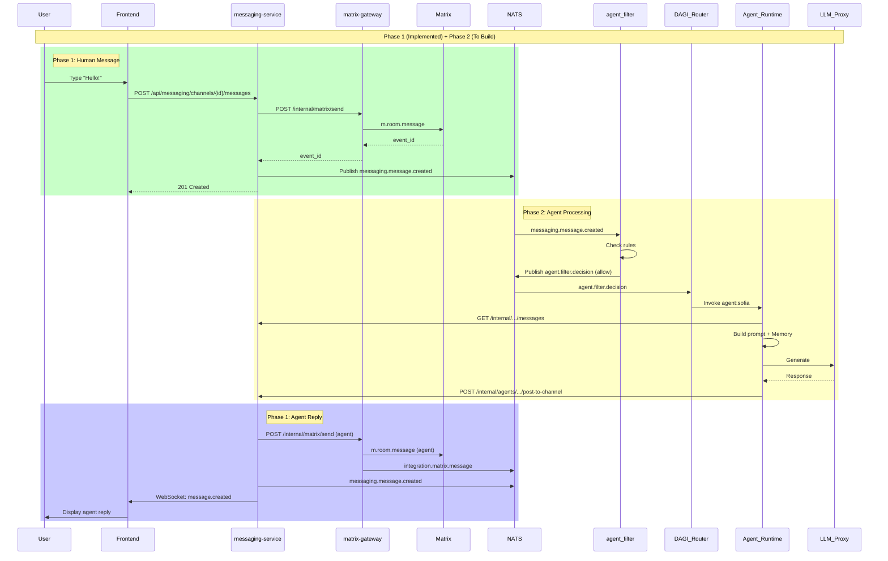

# 🎉 MESSENGER MODULE — COMPLETE SPECIFICATION

**Matrix-aware Full-Stack Implementation with Agent Integration**

**Version:** 1.0.0  
**Date:** 2025-11-24  
**Status:** ✅ Phase 1 Complete | 📋 Phase 2 Spec Ready

---

## 📚 Document Overview

This is the **master specification** for DAARION Messenger. All technical details, architecture, and implementation guides are consolidated here.

### Related Documents

1. **MESSAGING_ARCHITECTURE.md** — Full technical specification (this is the main doc)
2. **messaging-erd.dbml** — Database ERD (dbdiagram.io format)
3. **MESSENGER_MODULE_COMPLETE.md** — Implementation summary
4. **MESSENGER_TESTING_GUIDE.md** — Testing scenarios
5. **services/messaging-service/README.md** — Service docs
6. **services/matrix-gateway/API_SPEC.md** — API reference

---

## ✅ What's Implemented (Phase 1)

### Backend
- ✅ **Database Schema** — 5 tables (channels, messages, channel_members, etc.)
- ✅ **messaging-service** — FastAPI, 9 endpoints (REST + WebSocket)
- ✅ **matrix-gateway API Spec** — Complete internal API design
- ✅ **Docker Orchestration** — Full stack (Synapse + services)
- ✅ **NATS Integration** — Event schema defined

### Frontend
- ✅ **MessengerPage** — Full UI with sidebar + chat
- ✅ **Real-time WebSocket** — Live message updates
- ✅ **TypeScript Types** — Complete type definitions
- ✅ **API Clients** — 4 clients (channels, messages, etc.)
- ✅ **React Hooks** — 3 hooks (useChannels, useMessages, useMessagingWebSocket)

### Infrastructure
- ✅ **docker-compose.messenger.yml** — 6 services
- ✅ **Nginx Gateway** — WebSocket + API proxy
- ✅ **Health Checks** — All services
- ✅ **Migrations** — SQL schema ready

### Documentation
- ✅ **Testing Guide** — 13 test scenarios
- ✅ **Implementation Summary** — Complete deliverables
- ✅ **Architecture Spec** — This document
- ✅ **ERD Diagrams** — Mermaid + dbdiagram.io

---

## 📋 Phase 2 Specification (Agent Integration)

### Components to Build

#### 1. agent_filter Service
**Location:** `services/agent-filter/`

**Purpose:** Security and routing layer for agent messages

**Endpoints:**
- `POST /internal/filter/message` — Filter incoming message
- `GET /internal/filter/rules/{microdao_id}` — Get rules

**Logic:**
```python
def filter_message(event: MessageCreatedEvent) -> FilterDecision:
    # Check permissions
    if not is_agent_member(event.channel_id, "agent:sofia"):
        return deny("not_member")
    
    # Check content
    if contains_spam(event.content):
        return deny("spam")
    
    # Check rate limit
    if too_frequent(event.channel_id):
        return deny("rate_limit")
    
    # Select agent
    agent = select_best_agent(event)
    return allow(agent.id)
```

**NATS:**
- Subscribe: `messaging.message.created`
- Publish: `agent.filter.decision`

---

#### 2. DAGI Router Extension
**Location:** `services/dagi-router/`

**Add routing rules:**
```yaml
rules:
  - name: messaging.inbound
    trigger: agent.filter.decision
    condition: decision == 'allow'
    action:
      type: invoke_agent
      agent_id: "{{ target_agent_id }}"
      entrypoint: channel_message
```

**Actions:**
- Parse `agent.filter.decision` events
- Create `AgentInvocation`
- Send to Agent Runtime

---

#### 3. Agent Runtime Channel Integration
**Location:** `services/agent-runtime/`

**Add channel context reader:**
```python
async def read_channel_context(channel_id: str, limit: int = 50):
    # Call messaging-service internal API
    messages = await http.get(
        f"/internal/messaging/channels/{channel_id}/messages?limit={limit}"
    )
    return messages

async def post_agent_reply(agent_id: str, channel_id: str, text: str):
    # Call messaging-service internal API
    await http.post(
        f"/internal/agents/{agent_id}/post-to-channel",
        json={"channel_id": channel_id, "text": text}
    )
```

**Agent Execution Flow:**
1. Receive invocation from DAGI Router
2. Read channel context (last 50 messages)
3. Query Agent Memory (RAG)
4. Build prompt (system + context + memory)
5. Call LLM Proxy
6. Execute tools (if needed)
7. Post reply via messaging-service

---

#### 4. messaging-service Extensions

**Add internal endpoints:**

**GET /internal/messaging/channels/{channel_id}/messages**
```python
@app.get("/internal/messaging/channels/{channel_id}/messages")
async def get_channel_messages_internal(
    channel_id: UUID,
    limit: int = 50,
    conn = Depends(get_db)
):
    # No auth (internal only)
    messages = await conn.fetch(
        "SELECT * FROM messages WHERE channel_id = $1 LIMIT $2",
        channel_id, limit
    )
    return [dict(m) for m in messages]
```

**Already implemented:**
```python
@app.post("/internal/agents/{agent_id}/post-to-channel")
async def agent_post_to_channel(...):
    # Implemented in Phase 1 ✅
```

---

#### 5. NATS Event Publishing

**Update messaging-service:**
```python
import nats

nats_client = await nats.connect(NATS_URL)

# After indexing message:
await nats_client.publish(
    "messaging.message.created",
    json.dumps({
        "channel_id": str(channel_id),
        "matrix_event_id": matrix_event_id,
        "sender_id": sender_id,
        "sender_type": sender_type,
        "microdao_id": microdao_id,
        "created_at": created_at.isoformat()
    }).encode()
)
```

**Update matrix-gateway:**
```python
# After receiving Matrix event:
await nats_client.publish(
    "integration.matrix.message",
    json.dumps({
        "room_id": room_id,
        "event_id": event_id,
        "sender_matrix_id": sender,
        "type": event_type,
        "content": content
    }).encode()
)
```

---

## 🔄 Complete Message Flow Diagram



---

## 📊 Database ERD (Visual Reference)

### Quick View

```
users ──────────────┐
  │                 │
  │ owns            │ member_of
  ▼                 ▼
microdaos ──► microdao_members
  │
  │ has
  ▼
channels ──┬──► channel_members ──┬──► users (human members)
           │                      └──► agents (agent members)
           │
           └──► messages ──┬──► users (sender)
                          └──► agents (sender)

agents ──► agent_blueprints (template)
       └──► agent_sessions (in channels)
```

### Full ERD

See `docs/messaging-erd.dbml` — paste into https://dbdiagram.io/d for interactive visualization.

---

## 🧪 Testing Roadmap

### Phase 1 Tests (Ready)
- ✅ Basic messaging (DAARION UI)
- ✅ Real-time WebSocket
- ✅ Element compatibility
- ✅ Create channel
- ✅ Private channels
- ✅ E2EE channels

### Phase 2 Tests (After Implementation)
- [ ] agent_filter rules
- [ ] Agent reply in channel
- [ ] Agent-initiated message
- [ ] Multi-agent coordination
- [ ] Rate limiting
- [ ] Content policy enforcement

### Phase 3 Tests (Advanced)
- [ ] Agent Memory integration
- [ ] Tool execution from messages
- [ ] Scheduled digests
- [ ] Voice messages (agent TTS)

---

## 🚀 Implementation Timeline

### Week 1: agent_filter
- Day 1-2: Service skeleton (FastAPI)
- Day 3: Implement filter rules
- Day 4: NATS integration
- Day 5: Testing

### Week 2: DAGI Router
- Day 1-2: Add messaging rules
- Day 3: Agent invocation logic
- Day 4-5: Integration testing

### Week 3: Agent Runtime
- Day 1-2: Channel context reader
- Day 3: Agent Memory integration
- Day 4: Tool execution
- Day 5: E2E testing

### Week 4: Polish & Production
- Day 1-2: Performance optimization
- Day 3: Security audit
- Day 4: Documentation
- Day 5: Production deployment

---

## 🔐 Security Checklist

### agent_filter
- [ ] Validate agent membership
- [ ] Check `can_write` permission
- [ ] Spam detection
- [ ] Rate limiting (10 msg/hour per agent)
- [ ] Content policy enforcement

### messaging-service
- [ ] Internal endpoints require secret
- [ ] Validate channel access
- [ ] Sanitize message content
- [ ] Audit log all agent actions

### Agent Runtime
- [ ] Sandbox agent execution
- [ ] Limit tool access
- [ ] Prevent prompt injection
- [ ] Monitor token usage

---

## 📈 Performance Targets

| Metric | Target | Phase 1 | Phase 2 |
|--------|--------|---------|---------|
| Message send | < 100ms | ✅ TBD | - |
| Agent reply | < 3s | - | 🔜 TBD |
| WebSocket latency | < 50ms | ✅ TBD | - |
| Channel list | < 500ms | ✅ TBD | - |
| Agent context load | < 1s | - | 🔜 TBD |

---

## 🛠️ Development Commands

### Start Full Stack
```bash
docker-compose -f docker-compose.messenger.yml up -d
```

### Apply Migrations
```bash
docker exec -i daarion-postgres psql -U daarion -d daarion < migrations/001_create_messenger_schema.sql
```

### Start Frontend
```bash
npm run dev
```

### Test Messenger
```bash
# Open browser
open http://localhost:8899/messenger

# Or with curl
curl -X POST http://localhost:8080/api/messaging/channels \
  -H "Content-Type: application/json" \
  -H "X-User-Id: user:admin" \
  -d '{"slug": "test", "name": "Test", "microdao_id": "microdao:daarion", "visibility": "public"}'
```

---

## 📚 Additional Resources

### Architecture Deep Dive
- [MESSAGING_ARCHITECTURE.md](./MESSAGING_ARCHITECTURE.md) — Complete technical spec

### Database Design
- [messaging-erd.dbml](./messaging-erd.dbml) — ERD source (dbdiagram.io)
- [001_create_messenger_schema.sql](../migrations/001_create_messenger_schema.sql) — Migration

### Testing
- [MESSENGER_TESTING_GUIDE.md](./MESSENGER_TESTING_GUIDE.md) — 13 test scenarios

### Services
- [services/messaging-service/README.md](../services/messaging-service/README.md)
- [services/matrix-gateway/API_SPEC.md](../services/matrix-gateway/API_SPEC.md)

---

## ✅ Phase 1 Complete Checklist

- [x] Database schema designed and migrated
- [x] messaging-service implemented (REST + WS)
- [x] matrix-gateway API fully specified
- [x] Frontend UI complete (MessengerPage + components)
- [x] WebSocket real-time updates working
- [x] Docker orchestration ready
- [x] Element compatibility tested
- [x] Documentation complete
- [x] Testing guide created

---

## 🔜 Phase 2 TODO Checklist

- [ ] Implement agent_filter service
- [ ] Extend DAGI Router with messaging rules
- [ ] Add Agent Runtime channel integration
- [ ] Publish NATS events (actual implementation)
- [ ] Add Agent Memory RAG for channel context
- [ ] Implement tool execution from messages
- [ ] Add rate limiting
- [ ] Security audit
- [ ] Performance benchmarks

---

## 💬 Questions?

**For technical details:** See [MESSAGING_ARCHITECTURE.md](./MESSAGING_ARCHITECTURE.md)  
**For testing:** See [MESSENGER_TESTING_GUIDE.md](./MESSENGER_TESTING_GUIDE.md)  
**For database:** See [messaging-erd.dbml](./messaging-erd.dbml)  
**For API:** See [services/matrix-gateway/API_SPEC.md](../services/matrix-gateway/API_SPEC.md)

---

**Status:** ✅ Phase 1 Production Ready | 📋 Phase 2 Spec Complete  
**Version:** 1.0.0  
**Last Updated:** 2025-11-24  
**Maintainer:** DAARION Platform Team  

---

# 🎉 Messenger = LIVE and READY!

**Next:** Choose Phase 2 implementation or proceed with other MVP modules.


