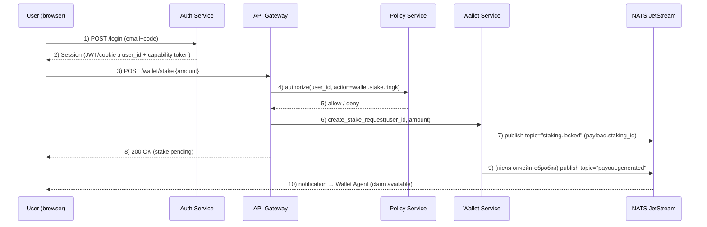
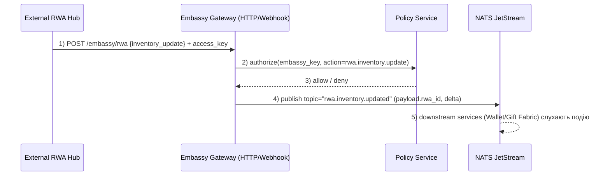
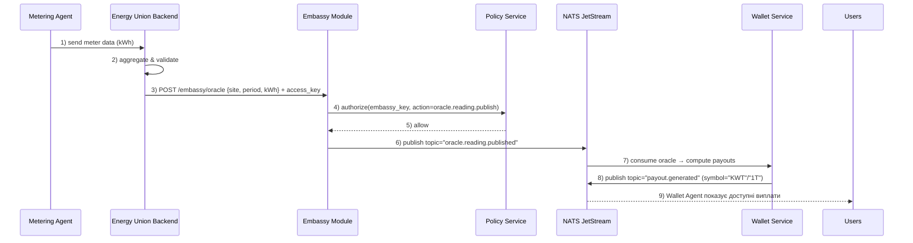

# 24 — Access Keys & Capabilities System (MicroDAO)

Універсальна система ключів доступу та capability-механіка

Цей документ описує універсальну систему ключів доступу (access keys) та capability-механіку для платформи **microdao / DAARION.city**:

- як видаються й перевіряються ключі;
- як описуються та застосовуються capabilities;
- як працюють **Wallet Agent** і **Embassy Module**;
- як система вбудовується в існуючі RBAC/Entitlements/Mode (public|confidential) та Governance.

Ціль: єдиний шар авторизації для веб-клієнта, приватних агентів, API, інтеграцій та зовнішніх платформ.

---

## 1. Purpose & Scope

Цей документ описує універсальну систему ключів доступу (access keys) та capability-механіку для платформи **microdao / DAARION.city**:

- як видаються й перевіряються ключі;
- як описуються та застосовуються capabilities;
- як працюють **Wallet Agent** і **Embassy Module**;
- як система вбудовується в існуючі RBAC/Entitlements/Mode (public|confidential) та Governance.

Ціль: єдиний шар авторизації для веб-клієнта, приватних агентів, API, інтеграцій та зовнішніх платформ.

---

## 2. Основні поняття

### 2.1 Access Key

Access Key — це матеріалізований «токен доступу» до певної області системи:

- має унікальний `key_id`;
- прив'язаний до **суб'єкта** (user / team / agent / external platform);
- має **набір capabilities**;
- має строк дії та статус (active / revoked / expired).

Приклади:

- ключ API для інтеграції з GreenFood;
- ключ приватного агента до Co-Memory та Projects;
- ключ Embassy для міжплатформенної взаємодії.

### 2.2 Capability

Capability — атомарне право **на дію над ресурсом**.

Формат (концептуально):

```text
<domain>.<resource>.<action>[:<scope>]
```

Приклади:

- `chat.message.send`
- `chat.channel.manage`
- `comemory.item.read:team`
- `projects.task.write`
- `wallet.balance.view`
- `wallet.stake.ringk`
- `governance.proposal.create`
- `energy.asset.read`
- `platform.greenfood.inventory.update`

### 2.3 Capability Bundle (role / plan / template)

Capability-набір:

- набір capabilities, який прив'язується до:
  - ролі (`Owner`, `Guardian`, `Member`, `Visitor`);
  - тарифного плану (Freemium / Casual / Premium / Platformium);
  - конкретного access key (API-ключ, агент, інтеграція).

---

## 3. Модель доступу (оновлена формула allow)

Базова формула авторизації:

```text
allow =
  RBAC(role, action, resource)
  ∧ Entitlement(plan, RINGK_staked)
  ∧ Capability(key, action, resource)
  ∧ ACL(resource)
  ∧ Mode(public|confidential)
```

Тобто:

1. Роль дозволяє дію (Owner/Guardian/Member/Visitor).
2. План + стейк RINGK дають достатні ліміти/право (ентайтли).
3. Ключ (user/agent/API) має відповідну capability.
4. ACL ресурсу не забороняє (список дозволених/заборонених).
5. Режим каналу/команди (public/confidential) не блокує дію.

---

## 4. Типи ключів

### 4.1 User Session Key

- Прив'язаний до користувача (`user_id`) і сесії (JWT / cookie).
- Використовується веб-клієнтом.
- Capabilities виводяться з ролі, ентайтлів і контексту (team, mode).

### 4.2 Agent Access Key

- Прив'язаний до приватного агента (`ag_…`).
- Використовується при викликах **Agent Mesh / Tooling API**.
- Має обмежений набір capabilities:
  - `chat.message.read:scoped`
  - `comemory.item.read:scoped`
  - `followups.create`
  - `projects.task.read/write` (за необхідності)
- Має обмеження за:
  - токенами/хв;
  - кількістю викликів;
  - бюджетом 1T / KWT.

### 4.3 API Key / Integration Key

- Прив'язаний до інтеграції (`integrations`).
- Наприклад: Notion, Slack, GreenFood, Energy Union, Water Union.
- Capabilities для зовнішнього сервісу:
  - `webhook.events.receive:team`
  - `projects.task.sync`
  - `rwa.energy.update`
  - `platform.greenfood.sync`

### 4.4 Embassy Key

- Ключ для **Embassy Module** — шлюз між DAARION.city та зовнішньою платформою/мережею.
- Додаткові властивості:
  - mapping зовнішніх ідентичностей (external_id ↔ DID/user_id);
  - whitelist дозволених типів актів (`intent.created`, `offer.published`, `gift.ack`, `rwa.claim` тощо);
  - окремий журнал дій для аудиту.

### 4.5 Wallet Capability Key

- Спеціальний ключ для **Wallet Agent**:
  - `wallet.balance.view`
  - `wallet.tx.initiate`
  - `wallet.tx.sign`
  - `wallet.stake.ringk`
  - `wallet.claim.rwa`
- Може бути:
  - нон-кастодіальний (підпис у клієнта, key лише для маршрутизації);
  - кастодіальний (wallet service з 4-eyes контролем).

---

## 5. Wallet Agent: специфікація

### 5.1 Призначення

Wallet Agent — це агент, який:

- показує баланси токенів (RINGK, 1T, KWT, DAAR, DAARION тощо);
- ініціює й перевіряє дії стейкінгу/unstake RINGK;
- показує історію payouts (1T/KWT);
- працює з RWA-сертифікатами (Energy, GREENFOOD тощо) через Embassy.

### 5.2 Основні флоу

1. **View balances**

- Виклик: `/wallet/balances`.
- Перевірка:
  - RBAC: будь-який Member+ / Owner/Guardian.
  - Capability: `wallet.balance.view`.
  - Mode: не залежить від public/confidential.

2. **Stake RINGK**

- Виклик: `/staking/ringk` (`amount`).
- Перевірка:
  - RBAC: Member+.
  - Capability: `wallet.stake.ringk`.
  - Entitlements: перевірка мінімального стейку, lock-параметрів.
  - Governance: параметри стейку (lock_until, min_amount) беруться з onchain/DAO-конфігів.

3. **Claim payouts (1T/KWT/RWA)**

- Флоу:
  - Wallet Agent читає `payouts`/`rwa_claims` з backend;
  - ініціює підпис транзакції користувачем;
  - виконує через onchain gateway/Embassy.
- Capabilities:
  - `wallet.payout.view`
  - `wallet.payout.claim`
  - `rwa.claim`

### 5.3 Дані (мінімум)

- `wallets` (user_id ↔ address)
- `staking_ringk`
- `payouts`
- `rwa_certificates` / `rwa_claims` (через Embassy)

---

## 6. Embassy Module: специфікація

### 6.1 Призначення

Embassy Module — шар інтеграції між:

- DAARION.city (місто агентів, microdao);
- зовнішніми платформами (GreenFood, Energy Union, інші RWA-ініціативи);
- публічними мережами (L2, marketplace, вузли взаємообміну).

Він відповідає за:

- мапінг ідентичностей;
- валідацію актів взаємодії;
- трансформацію подій і capability-рівнів.

### 6.2 Ідентичності

- `resident_id` ↔ `user_id`/DID.
- `district_id` ↔ team/microDAO.
- `agent_id` ↔ citizen-agent.
- `rwa_id` ↔ сертифікат дару/актив RWA.

Embassy Key має capability-набори:

- `embassy.intent.read/write`
- `embassy.rwa.claim`
- `embassy.energy.update`
- `embassy.audit.view`

### 6.3 Події (канонічні акти)

- `intent.created`
- `offer.published`
- `gift.ack`
- `memory.update`
- `rwa.claim`
- `energy.update`

Embassy:

- приймає подію через webhook / шину (NATS);
- перевіряє capability Embassy Key;
- трансформує в внутрішні події (`reward.*`, `oracle.*`, `payout.*`).

---

## 7. Runtime capability-check

### 7.1 Компоненти

- **PDP** (Policy Decision Point) — сервіс, який:
  - приймає контекст запиту: `user_id / agent_id`, `team_id`, `resource`, `action`, `mode`, `key_id`;
  - повертає `allow/deny` + причину.
- **PEP** (Policy Enforcement Point):
  - live у API-gateway і сервісах (Messaging, Projects, Wallet, Governance).

### 7.2 Кеш і формат токена

- Для кожного access key формується компактний «capability token»:
  - `sub` (user/agent/integration);
  - `team_scope`;
  - `caps` (список capability кодів або bitmap);
  - `exp`.
- Токен зберігається в Redis / in-memory кеші для швидкої перевірки.

### 7.3 Приклади перевірок

1. Агент хоче прочитати Co-Memory:

```text
action = comemory.item.read
resource = chat: c_123
mode = confidential
subject = ag_456
key_id = ak_789

→ RBAC: owner of agent = Member в team t_1
→ Entitlements: план дозволяє приватні агенти
→ Capability(ak_789): містить comemory.item.read:scoped
→ ACL: чат дозволяє агентів
→ Mode: confidential → E2EE, агент отримує лише векторні ознаки/summary

→ allow
```

2. Зовнішній RWA-хаб оновлює енергетичний актив:

```text
action = energy.update
subject = embassy_key ek_001
→ Capability(ek_001): енергетичні оновлення дозволені для конкретного district_id
→ Governance: політика для цього district_id активна

→ allow
```

---

## 8. Інтеграція з Governance Agent

Governance Agent:

- має capability `governance.policy.manage` (тільки Owner/Guardian через DAO-процес);
- може:
  - створювати/оновлювати **capability bundles**;
  - прив'язувати bundles до ролей/планів/ключів;
  - змінювати пороги доступу (напр. min RINGK stake для Premium/Platformium).

Флоу:

1. Створюється пропозиція (onchain / в DAO Service):
   - змінити набір capabilities для `Platformium` плану;
   - додати capability `platform.greenfood.inventory.update`.
2. Пропозиція голосується токеном DAARION.
3. Після прийняття Governance Agent:
   - оновлює конфіг у Capability Registry;
   - виконує міграцію активних access keys;
   - логуються події `governance.policy.updated`.

---

## 9. Дані та моделі (мінімальна схема)

Таблиці (спрощений вигляд):

```sql
create table access_keys (
  id text primary key,        -- ak_...
  subject_kind text not null, -- user|agent|integration|embassy
  subject_id text not null,
  team_id text null,
  name text not null,
  status text not null check (status in ('active','revoked','expired')),
  created_at timestamptz not null default now(),
  expires_at timestamptz null
);

create table capabilities (
  id text primary key,        -- cap_...
  code text not null,         -- chat.message.send, wallet.stake.ringk
  description text not null
);

create table access_key_caps (
  key_id text references access_keys(id) on delete cascade,
  cap_id text references capabilities(id) on delete cascade,
  primary key (key_id, cap_id)
);

create table bundles (
  id text primary key,        -- bundle_...
  name text not null,         -- e.g. "role.Member", "plan.Premium", "agent.default"
  created_at timestamptz not null default now()
);

create table bundle_caps (
  bundle_id text references bundles(id) on delete cascade,
  cap_id text references capabilities(id) on delete cascade,
  primary key (bundle_id, cap_id)
);
```

Access key може наслідувати capabilities з одного чи кількох bundles.

---

## 10. Безпека

- Мінімізований набір capabilities за замовчуванням (principle of least privilege).
- Для confidential-контенту:
  - агенти не отримують plaintext без явної згоди;
  - Embassy не передає контент, тільки агреговані/векторні дані.
- Всі access keys:
  - зберігаються у зашифрованому вигляді (KMS);
  - мають короткий час життя, періодичну ротацію;
  - мають аудит використання (audit_log).

---

## 11. Інтеграція з RBAC & Entitlements

Посилання на документ: `microdao — RBAC і Entitlements (MVP).docx`

1. Розширена формула доступу (оновлює пункт 2 у RBAC-документі):

```text
allow =
  RBAC(role, action, resource)
  ∧ Entitlement(plan, RINGK_staked)
  ∧ Capability(key, action, resource)
  ∧ ACL(resource)
  ∧ Mode(public|confidential)
```

2. Мапінг ролей з RBAC → capability bundles:

- з таблиць `team_members.role` (`Owner`, `Guardian`, `Member`) та viewer-type (`reader`, `commenter`, `contributor`) формуються стартові bundles:
  - `bundle.role.Owner`
  - `bundle.role.Guardian`
  - `bundle.role.Member`
  - `bundle.role.Visitor` (для гостя в public-каналах).
- кожен bundle включає capabilities, що відповідають матрицям з розділу «4) Ресурси → дії (матриці)» RBAC-документу
  (Community, Channels, Messages, Follow-ups, Projects, Tasks, Docs, Meetings).

3. Мапінг Entitlements (плани + стейк RINGK):

- таблиці з Data Model:
  - `wallets`
  - `staking_ringk`
- плани з RBAC-документу (`Freemium`, `Casual`, `Premium`, `Platformium`) задаються як:
  - `bundle.plan.Freemium`
  - `bundle.plan.Casual`
  - `bundle.plan.Premium`
  - `bundle.plan.Platformium`
- формула з RBAC → в capability-рівень:

```text
effective_quota = min(plan_quota × multiplier(RINGK_staked), hard_limit)
```

- ліміти прив'язуються до capabilities на кшталт:
  - `chat.message.send`
  - `agent.run.invoke`
  - `router.invoke`
  - `wallet.payout.claim`

---

## 12. Інтеграція з Security Architecture & Threat Model

Посилання: `microdao — Security Architecture & Threat Model (MVP).docx`

1. Зберігання ключів:

- метадані ключа — в таблиці `access_keys` (див. розділ 13 нижче);
- сам секрет (`secret`) зберігається зашифрованим (KMS/HSM), згідно з розділами про secrets у Security Architecture;
- one-time reveal: після створення ключ не показується повторно.

2. Транспорт і токени:

- веб-клієнт:
  - використовує сесію (`users` + сесійні токени на рівні Auth);
  - capability-набір інкапсульовано в «capability token» (JWT/opaque), який несе:
    - `sub` (u_/ag_/integr),
    - `team_id`,
    - стиснений список `caps`.
- API/Webhooks/Embassy:
  - ключ передається в `Authorization: Bearer <access_key_secret>` або в окремому заголовку;
  - підпис вебхуків (Embassy) — HMAC, як у Security Architecture.

3. Confidential-режим:

- `teams.mode` ∈ (`public`, `confidential`);
- для `mode='confidential'`:
  - агенти з Agent Access Key не бачать `chat_message.body` у plaintext,
  - доступ дається до:
    - агрегованих структур (`comemory_items`),
    - embeddings/summary, сформованих локально або в E2EE-шарі;
- це наслідує E2EE-модель з Security-документу (сервер бачить мінімум метаданих).

4. Threat model для access keys:

- нові активи:
  - `access_keys`, `bundles`, capability-кеш;
- загрози:
  - компрометація ключа, зловживання Embassy-ключем, масовий abuse agent-ключів;
- мітiгації:
  - короткий `expires_at`, обов'язкова ротація;
  - strict capabilities (least privilege);
  - обов'язковий аудит через події `audit.event` і нові `access_key.*` (див. нижче).

---

## 13. Інтеграція з Data Model & Event Catalog

Посилання: `microdao — Data Model & Event Catalog.docx`

1. Нові таблиці (додати в розділ DB-схеми, поруч із Wallet / Governance):

```sql
create table access_keys (
  id text primary key,        -- ak_...
  subject_kind text not null, -- 'user' | 'agent' | 'integration' | 'embassy'
  subject_id text not null,   -- u_/ag_/...
  team_id text null,          -- t_..., якщо scoped до команди
  name text not null,
  status text not null check (status in ('active','revoked','expired')),
  created_at timestamptz not null default now(),
  expires_at timestamptz null,
  last_used_at timestamptz null
);

create table capabilities (
  id text primary key,        -- cap_...
  code text not null unique,  -- chat.message.send, wallet.stake.ringk, ...
  description text not null
);

create table access_key_caps (
  key_id text references access_keys(id) on delete cascade,
  cap_id text references capabilities(id) on delete cascade,
  primary key (key_id, cap_id)
);

create table bundles (
  id text primary key,        -- bundle_...
  name text not null unique,  -- role.Member / plan.Premium / agent.default
  created_at timestamptz not null default now()
);

create table bundle_caps (
  bundle_id text references bundles(id) on delete cascade,
  cap_id text references capabilities(id) on delete cascade,
  primary key (bundle_id, cap_id)
);
```

- конвенції ID узгоджуються з розділом «2) Конвенції»:
  - `ak_…` для access keys;
  - `cap_…` для capabilities;
  - `bundle_…` для bundle-ів.

2. Прив'язка до існуючих таблиць:

- `access_keys.subject_id` → `users.id` / `agents.id` / `integrations.id` / Embassy-ідентифікатори (згідно з Data Model);
- `access_keys.team_id` → `teams.id` (team як microDAO/платформа).

3. Нові події для Event Catalog (розширення enum `topic`):

Додати в список `topic.enum`:

```jsonc
"access_key.created",
"access_key.revoked",
"access_key.used"
```

та окремі `allOf`-entry з `$defs`:

```jsonc
// envelope.topic = "access_key.created"
"access_key_created": {
  "type": "object",
  "properties": {
    "key_id": { "type": "string" },
    "subject_kind": { "type": "string" },
    "subject_id": { "type": "string" },
    "team_id": { "type": ["string","null"] }
  },
  "required": ["key_id","subject_kind","subject_id"]
}
```

аналогічні схеми для `access_key.revoked` і `access_key.used`
(з полями `revoked_by`, `action`, `resource_kind`).

4. Зв'язок з уже наявними подіями:

- `staking_ringk` + `payouts` вже мають події:
  - `"staking.locked"`
  - `"payout.generated"`
  - `"rwa.inventory.updated"`
- Wallet Agent та Embassy в sequence-діаграмах нижче використовують саме ці topic-и; capability-check визначає, хто має право ініціювати або читати ці події.

---

## 14. Sequence-діаграми (ключові флоу)

### 14.1 Wallet Agent: login → access key → capability-check → stake RINGK



### 14.2 Embassy Module: external RWA → Embassy → capability-check → internal events



### 14.3 Energy Union: meter → Energy Union → Embassy → payouts



---

## 15. Завдання для Cursor

```text
You are a senior backend engineer. Implement the Access Keys & Capabilities System using:
- 24_access_keys_capabilities_system.md
- 18_governance_access_agent.md
- 23_domains_wallet_dao_deepdive.md
- 05_coding_standards.md

Tasks:
1) Create database schema: access_keys, capabilities, access_key_caps, bundles, bundle_caps.
2) Implement PDP (Policy Decision Point) service.
3) Integrate PEP (Policy Enforcement Point) into API Gateway.
4) Implement Wallet Agent endpoints with capability checks.
5) Create Embassy Module stub with capability validation.
6) Add capability-check middleware for all API endpoints.

Output:
- list of modified files
- diff
- summary
```

---

## 16. Результат

Після впровадження цієї системи:

- єдиний шар авторизації для всіх типів доступу (users, agents, integrations, platforms);
- чіткий контроль прав через capabilities;
- інтеграція з Wallet Agent та Embassy Module;
- підготовка до масштабування та додавання нових платформ.

