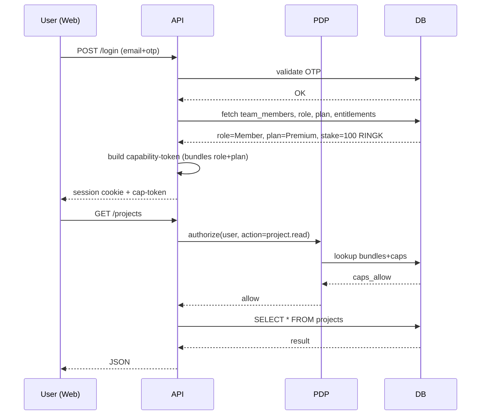
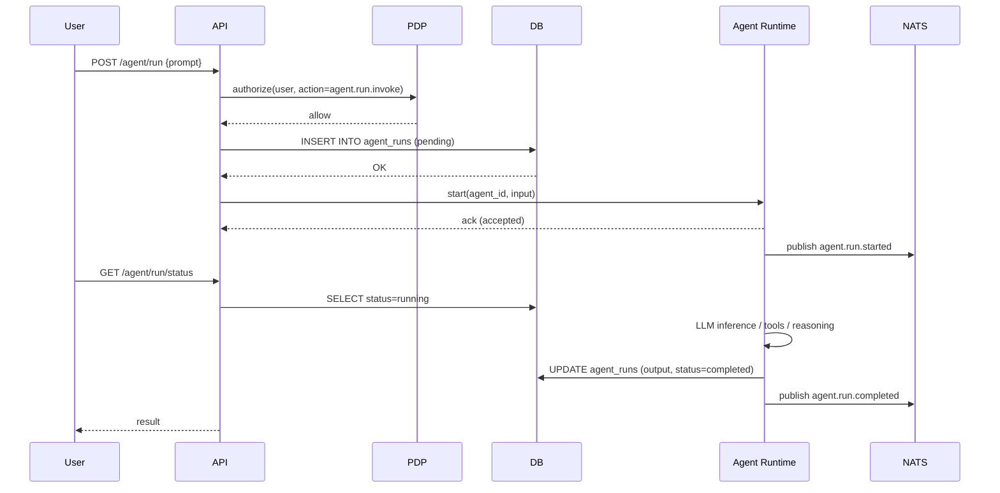
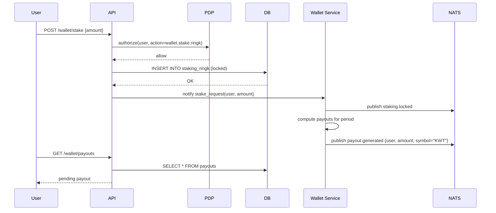
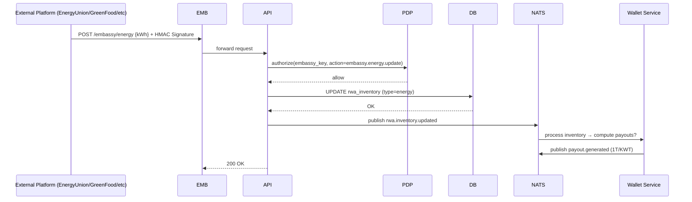
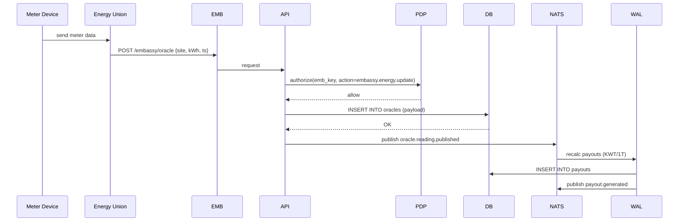
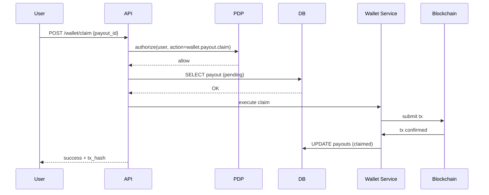
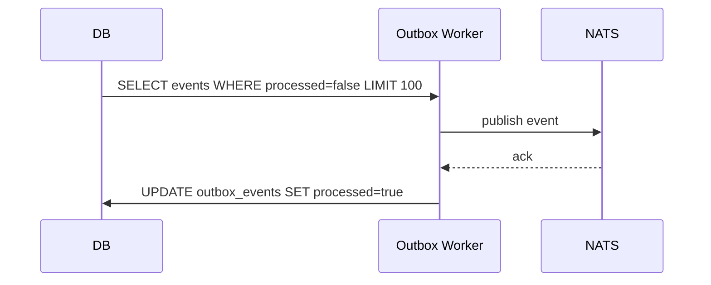
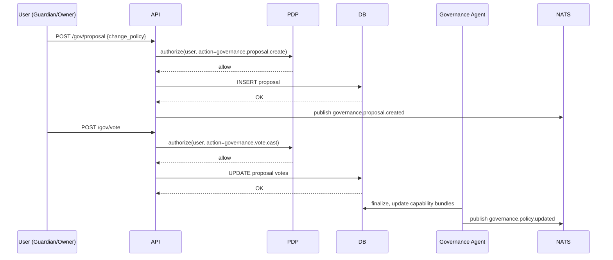

# 28 — Flows: Wallet, Embassy, Energy Union (MicroDAO)

*Sequence-діаграми основних критичних потоків: авторизація, Wallet, Embassy, Energy Union, NATS Outbox*

Це документ візуалізацій — «центральна нервова система» проєкту.

Він показує, як працює процес:

- login → capability → action,
- stake RINGK → payouts,
- embassy → nats → services,
- oracle updates → RWA → wallet,
- agent runs → PDP.

Усі діаграми подані в **Mermaid**, GitHub рендерить їх автоматично.

---

## 1. Purpose

Цей документ описує **динамічні потоки** (sequence diagrams) між сервісами:

- frontend (web),
- API Gateway (PEP),
- PDP (Policy Decision Point),
- Postgres (DB),
- NATS JetStream (event bus),
- Wallet Service,
- Embassy Service,
- Energy Union,
- Agent Mesh.

Ці діаграми є частиною безпекового аудиту, дебагу, тестування, QA та документації для інтеграцій.

---

## 2. Legend

```
U      – User (browser/app)
A      – Agent (private agent)
API    – API Gateway (PEP)
PDP    – Policy Service (capability checks)
DB     – Postgres (core data)
WAL    – Wallet Service
NATS   – JetStream Event Bus
EMB    – Embassy Gateway
EU     – Energy Union backend
RUN    – Agent Runtime
```

---

## 3. Login → Capability Token → Action



---

## 4. Agent Run (Router → PDP → DB → RUN → NATS)



---

## 5. Stake RINGK → Payout Flow

Це один із ключових потоків у DAARION (економічна модель).



---

## 6. Embassy Webhook → PDP → RWA Inventory → Wallet/NATS



---

## 7. Energy Union → Embassy Oracle → NATS → Wallet



---

## 8. Wallet Claim Flow (User Claims Payout)



---

## 9. Outbox → NATS Delivery (Guarantee: At-Least-Once)



---

## 10. Governance Flow (Proposal → Vote → Policy Update)



---

## 11. Threat Model Integration Points

| Flow                  | Threat                     | Mitigation                                        |
| --------------------- | -------------------------- | ------------------------------------------------- |
| Embassy webhook → API | Fake source, replay attack | HMAC + timestamp + PDP-check                      |
| Wallet claim          | Double-spend               | DB row-level lock + chain receipt                 |
| Agent run             | Prompt injection           | Input sanitization + safe tools                   |
| Confidential channels | E2EE bypass                | No plaintext server-side, agent gets summary only |
| NATS events           | Lost events                | Outbox pattern                                    |
| RWA updates           | Poisoned oracle            | PDP + oracle signature + anomaly detection        |
| Payout generation     | Fake energy data           | embassy_key capabilities + oracle signatures      |

---

## 12. Summary

Документ покриває основні системні флоу, які визначають:

- безпеку,
- економіку,
- консистентність,
- надійність,
- інтеграцію з RWA,
- роботу агентів.

Діаграми можуть бути імпортовані у Confluence/Notion/Docs автоматично.

---

## 13. Завдання для Cursor

```text
You are a senior backend engineer. Implement the flows described in:
- 28_flows_wallet_embassy_energy_union.md
- 24_access_keys_capabilities_system.md
- 12_agent_runtime_core.md

Tasks:
1) Implement PDP (Policy Decision Point) service.
2) Implement PEP (Policy Enforcement Point) middleware for API Gateway.
3) Implement Outbox Worker for NATS event delivery.
4) Implement Wallet Service with stake/payout flows.
5) Implement Embassy Gateway with webhook signature verification.
6) Add sequence diagram validation tests.

Output:
- list of modified files
- diff
- summary
```

---

## 14. Результат

Після впровадження цих потоків:

- чітко визначені всі критичні системні інтеграції;
- готовність до тестування end-to-end сценаріїв;
- документація для QA та інтеграційних тестів;
- основа для моніторингу та дебагу production issues.

---

**Версія:** 1.0  
**Останнє оновлення:** 2024-11-14
