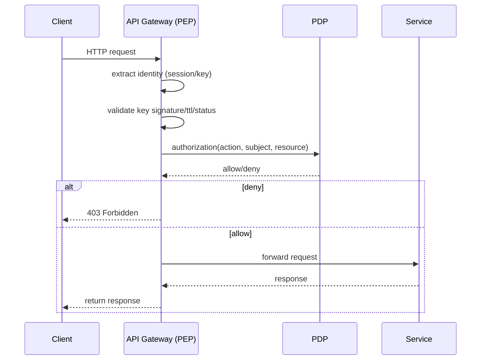

# 33 — API Gateway Security & PEP (MicroDAO)

*API Gateway Architecture, Policy Enforcement Point (PEP), Rate Limiting, Key Validation, PDP Integration, Embassy/Webhook Security, Usage Accounting*

---

## 1. Purpose & Scope

API Gateway — це **єдина точка входу** для всіх зовнішніх та внутрішніх HTTP-запитів у DAARION.city:

- web-клієнтів (user/browser),
- приватних агентів,
- Embassy інтеграцій,
- mobile/desktop клієнтів,
- сторонніх сервісів DAARION-платформ.

Цей документ описує:

- архітектуру Gateway,
- логіку Policy Enforcement Point (PEP),
- інтеграцію з PDP,
- rate limiting на кожному рівні,
- захист API keys, агентів, Embassy,
- audit/logging/usage,
- безпекові guardrails.

---

## 2. High-level Architecture

```
                          ┌──────────────────────────┐
                          │      Load Balancer        │
                          └─────────────┬────────────┘
                                        │
                           ┌────────────┴────────────┐
                           │     API Gateway (PEP)    │
                           └────────────┬────────────┘
                                        │
          ┌──────────────┬──────────────┼──────────────┬───────────────┐
          │              │              │              │                │
       Core API       Agent API     Embassy API    Wallet API       Webhooks
```

Gateway = PEP (Policy Enforcement Point) + Key Validator + Rate Limiter + Router + Logging Engine.

---

## 3. Key Responsibilities

### 3.1 Authentication

- User session tokens (cookies).
- Access Keys (user/agent/integration).
- Embassy HMAC signatures.
- Internal service JWT (якщо потрібно).

### 3.2 Authorization (PEP)

- виклик PDP для кожного action:

  ```text
  action = <resource>.<operation>
  ```

- PDP повертає allow/deny.

### 3.3 Key Lifecycle Management

- дієвість,
- TTL,
- rotation,
- revocation,
- rate limiting.

### 3.4 Usage Accounting

- лічильники:
  - LLM tokens,
  - agent runs,
  - router invokes,
  - storage size,
  - embassy events,
  - wallet tx.

### 3.5 Transport Security

- TLS termination,
- CORS,
- header hardening.

---

## 4. Request Flow



---

## 5. Identity Sources

### 5.1 User Identity

Отримується з:

- session cookie,
- або user access key.

### 5.2 Agent Identity

- кожен агент має `ak_*` key:

  ```text
  subject_kind = "agent"
  subject_id = "ag_*"
  ```

### 5.3 Embassy Identity

Webhook-платформи не використовують JWT/keys, тільки:

- HMAC signature,
- timestamp,
- platform_id.

API Gateway перевіряє:

```text
valid_signature AND timestamp < skew_limit
```

### 5.4 Integration Keys

Треті сторони:

- access_key з capability: `integration.*`

---

## 6. Key Validation Pipeline

Перед PDP-викликом Gateway перевіряє:

1. **isAccessKeyPresent**
2. **isKnownKeyFormat** (ak_xxx)
3. **isKeyActive (status=='active')**
4. **notExpired (expires_at > now)**
5. **notRevoked**
6. **rateLimitPerKey**
7. **IP throttling**
8. **geo restrictions** (опційно)
9. **isAllowedSubjectType** (user/agent/integration/embassy)

У разі невідповідності — **403 Forbidden**.

---

## 7. PDP Integration

Gateway формує PDP-запит:

```json
{
  "subject": {
    "id": "u_1",
    "type": "user"
  },
  "team_id": "t_123",
  "action": "task.create",
  "resource": {
    "id": "p_44",
    "team_id": "t_123",
    "mode": "public"
  },
  "key_id": "ak_777"
}
```

PDP відповідає:

```text
allow / deny
reason
quota_status
```

### 7.1 Hard-deny reasons:

- key_invalid
- capability_missing
- rbac_denied
- acl_block
- confidential_restriction
- quota_exceeded

---

## 8. Rate Limiting Layer

Gateway має багаторівневий rate limiting.

### 8.1 Global (per environment)

Наприклад:

```text
1000 req/sec (dev)
5000 req/sec (staging)
20000 req/sec (prod)
```

### 8.2 Per IP

Запобігає DDOS:

```text
100 req/min
```

### 8.3 Per KEY (access_key_id)

Важливо для:

- agent keys,
- integration keys,
- embassy keys.

Наприклад:

```text
50 req/min for Freemium
200 req/min for Premium
1000 req/min for Platformium
```

### 8.4 Per ACTION

Деякі дії дорогі:

| Action              | Ліміт   |
| ------------------- | ------- |
| agent.run.invoke    | 10/min  |
| router.invoke       | 30/min  |
| wallet.payout.claim | 2/min   |
| embassy.rwa.claim   | 120/min |
| chat.message.send   | 300/min |

### 8.5 Per TEAM

Для захисту БД.

---

## 9. Resource Context Extraction

Gateway визнає ресурс з URL.

Приклади:

| Endpoint           | Resource           | Action             |
| ------------------ | ------------------ | ------------------ |
| POST /tasks        | project_id=payload | task.create        |
| POST /messages     | channel_id=payload | chat.message.send  |
| POST /wallet/stake | team_id=user.team  | wallet.stake.ringk |
| POST /embassy/rwa  | platform=header    | embassy.rwa.claim  |
| POST /agent/run    | agent_id           | agent.run.invoke   |

---

## 10. Confidential Mode Enforcement

Gateway застосовує **PEP-level enforcement**:

```text
if resource.mode == confidential:
    if subject.kind == "agent":
        if action in ["chat.message.read"]:
            deny
```

Усі інші повідомлення:

- plaintext → не передається агенту,
- агент отримує `summary`, `embeddings`, `role`.

---

## 11. Embassy Webhook Security

Для платформи (EnergyUnion, GREENFOOD, Water Union):

### 11.1 Gateway виконує:

1. Перевірка HMAC:

   ```text
   HMAC(key=emb_secret, body)
   ```

2. Перевірка `X-Timestamp`:

   ```text
   |client_ts - server_ts| < 5 min
   ```

3. Формування PDP-запиту:

   ```text
   action = embassy.energy.update
   subject_kind = embassy
   subject_id = emb_<platform>
   ```

4. Quota-check (events per day)
5. Forward до Embassy Service

### 11.2 Відмова у разі:

- HMAC mismatch
- expired timestamp
- excess quota
- revoked embassy key

---

## 12. Wallet API Security

Wallet endpoints — найбільш критичні.

Gateway виконує:

1. PDP:
   - `wallet.stake.ringk`
   - `wallet.payout.claim`
   - `wallet.balance.view`
2. Rate limiting (дуже низький)
3. Additional anti-fraud rules:
   - geo-check (опційно)
   - user consistency (IP fingerprint)
4. DB-level locking (handled by wallet service)
5. Chain RPC protection (delayed retry, jitter)

---

## 13. Agent API Security

Агенти — потенційно небезпечний трафік.

Gateway блокує:

1. розширені network operations (якщо немає capability)
2. небезпечні MIME-types
3. надмірно великі payloads (>512KB)
4. токсичні параметри (regex sanitize)
5. DoS через parallel agent runs

Агентні ключі мають capability:

- `agent.run.invoke`
- `tool.*`
- `router.invoke`

---

## 14. Quota Enforcement Integration

Після дозволу PDP, Gateway викликає:

- `usage.increment(team_id, action, units)`

Приклад:

- для LLM tokens → units = tokens
- для agent-run → units = 1
- для wallet claim → units = 1
- для Embassy event → units = 1

Якщо usage впритул → soft-limit → warning header.

---

## 15. Logging Model

Gateway пише логи:

- request_id
- subject_id
- key_id
- action
- team_id
- latency
- status
- quota_status
- PDP result
- IP/UA

Логи **не містять plaintext** чату.

---

## 16. API Hardening

Gateway застосовує:

### 16.1 Headers

- `X-Frame-Options: DENY`
- `X-Content-Type-Options: nosniff`
- `Referrer-Policy: strict-origin-when-cross-origin`
- `Content-Security-Policy: frame-ancestors 'none'; script-src 'self' 'unsafe-inline'`

### 16.2 Disable methods

- TRACE
- OPTIONS (лише preflight)
- CONNECT

### 16.3 Payload limits

- max JSON body size (0.5–2 MB)
- timeouts (3–5 сек)

---

## 17. Error Model

Gateway повертає стандартизовані помилки:

| Код | Статус          | Причина           |
| --- | --------------- | ----------------- |
| 401 | unauthenticated | no session/key    |
| 403 | forbidden       | PDP deny          |
| 429 | rate_limited    | too many requests |
| 400 | invalid_payload | schema mismatch   |
| 500 | internal_error  | unexpected        |

---

## 18. Performance Targets

- p95 < 10 ms (навіть з PDP)
- p99 < 25 ms
- 20k rps sustained
- zero-downtime redeploy

---

## 19. Failover & Resilience

- Retry PDP з exponential backoff.
- Circuit-breaker:
  - PDP недоступний → deny non-critical ops.
- Horizontal autoscaling.
- Canary deployments.

---

## 20. Integration with Other Docs

Цей документ доповнює:

- `32_policy_service_PDP_design.md`
- `31_governance_policies_for_capabilities_and_quotas.md`
- `26_security_audit.md`
- `24_access_keys_capabilities_system.md`
- `25_deployment_infrastructure.md`
- `29_scaling_and_high_availability.md`

---

## 21. Завдання для Cursor

```text
You are a senior backend engineer. Implement API Gateway / PEP using:
- 33_api_gateway_security_and_pep.md
- 32_policy_service_PDP_design.md
- 24_access_keys_capabilities_system.md

Tasks:
1) Create API Gateway service with PEP middleware.
2) Implement key validation pipeline.
3) Integrate with PDP for authorization.
4) Implement multi-level rate limiting (global, per-IP, per-key, per-action, per-team).
5) Add Embassy webhook security (HMAC, timestamp validation).
6) Implement Wallet API security (anti-fraud, rate limiting).
7) Add Agent API security (payload validation, DoS protection).
8) Implement quota enforcement integration.
9) Add logging and audit.
10) Implement API hardening (headers, payload limits, timeouts).

Output:
- list of modified files
- diff
- summary
```

---

## 22. Summary

API Gateway / PEP — це:

- єдина точка контролю доступів,
- захист від зловживань,
- інтеграція з PDP,
- enforcement квот,
- захист Embassy та вебхуків,
- критичний елемент Wallet/Chain безпеки,
- потужний rate limiting,
- основа для agent-безпеки,
- фундамент всієї системи авторизації DAARION.city.

---

**Версія:** 1.0  
**Останнє оновлення:** 2024-11-14


