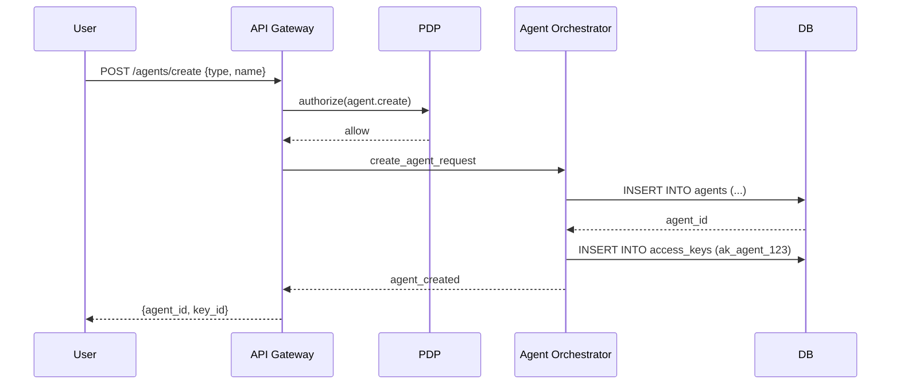
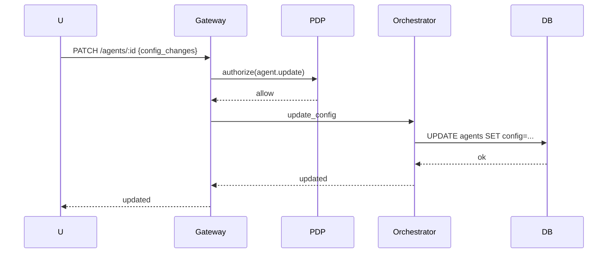
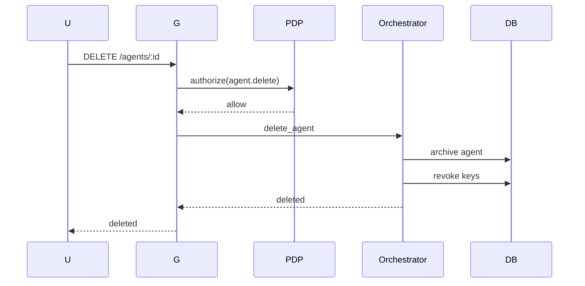

# 38 — Private Agents Lifecycle & Management (MicroDAO)

*Життєвий цикл приватних агентів, створення, конфігурація, ключі доступу, capability-політики, оновлення, відновлення, видалення, безпечний аудит*

---

## 1. Purpose & Scope

Цей документ описує **повний життєвий цикл приватного агента**:

- створення
- реєстрація та ініціалізація
- конфігурація
- генерація ключів
- робота та інвокації
- оновлення моделі
- облік пам'яті
- логування
- безпека
- призупинення
- видалення

Це must-have документ для:

- core backend,
- agent orchestrator team,
- security team,
- governance,
- app UI.

---

## 2. What Is a Private Agent?

Приватний агент — це:

```text
Індивідуальний асистент, прив'язаний до:
- користувача або
- команди (microDAO)
```

Має:

- власну конфігурацію,
- власні ключі доступу,
- власні capabilities,
- власні usage-ліміти,
- власний sandbox,
- окремі логи,
- окремий vault для embedding-based memory.

---

## 3. Agent Types

1. **User Agent**
   - створений для конкретного користувача
   - ключ: `ak_agent_u_*`

2. **Team Agent (microDAO)**
   - належить команді
   - доступ має Owner/Guardian
   - ключ: `ak_agent_t_*`

3. **System Agent**
   - глобальні агенти DAARION
   - ключ: `ak_agent_sys_*`

---

## 4. Agent Creation Flow

Sequence:



---

## 5. Agent Schema (DB)

```sql
create table agents (
  id text primary key,
  team_id text,
  owner_user_id text,
  name text,
  description text,
  llm_model text,        -- default model
  config jsonb,          -- toolsets, behavior, limits
  created_at timestamptz,
  updated_at timestamptz,
  archived bool default false
);
```

---

## 6. Agent Initialization (Bootstrap)

### Під час створення агент отримує:

- capabilities:

  ```text
  agent.run.invoke
  agent.read.summary
  tool.<safe>.* (math, text, memory, embeddings)
  ```

- планові ліміти:
  - max_runs_per_day (залежить від плану)
  - max_cost_per_run

- sandbox контракти:
  - cpu/memory/timeouts

- default LLM model (team default або global default)

---

## 7. Agent Access Keys

### Генерується 1 або більше ключів:

```text
ak_agent_<agent_id>_<random>
```

З capability-наборами:

- `agent.run.invoke`
- `tool.safe.*`
- (опціонально) `tool.internal.*`
- (опціонально) `tool.llm.invoke`

Ключ:

- активний / призупинений / видалений
- має ttl (опціонально)
- може бути re-rotated

---

## 8. Agent Configuration Model

У таблиці `agents.config` зберігається JSON:

```json
{
  "model": "gpt-4o-mini",
  "system_prompt": "You are a private agent...",
  "tools_allowed": ["math", "text", "memory"],
  "max_tokens": 12000,
  "max_parallel_runs": 2,
  "sandbox_limits": {
    "timeout_sec": 60,
    "cpu": "0.5",
    "memory": "512m"
  }
}
```

### Governance може оновити:

- `tools_allowed`,
- максимальні ліміти,
- доступ до категорії C/D tools.

---

## 9. Agent Update Flow



---

## 10. Agent Run Lifecycle

### 10.1 Start

- Gateway перевіряє `agent.run.invoke`.
- Orchestrator створює новий запис у `agent_runs`.

### 10.2 Sandbox Spin-Up

Orchestrator:

- створює sandbox,
- завантажує config.agents,
- створює контекст:
  `agent_run_id`, `team_id`, `usage_counters`.

### 10.3 Execute

Sandbox:

- бере prompt,
- запускає LLM chain,
- викликає дозволені інструменти,
- логування в окремий канал,
- memory summarization (опціонально).

### 10.4 Complete

Orchestrator:

- пише результат у DB,
- публікує подію:

  ```text
  agent.run.completed
  ```

- повертає відповідь Gateway → користувачу.

---

## 11. Agent Memory Policy

### 11.1 No plaintext storage

Агент не може зберігати raw messages.

### 11.2 Memory via Summaries

Дозволено:

- короткі текстові summaries,
- embeddings vectors.

Зберігаються в `comemory_items`.

### 11.3 Team Confidentiality

Якщо команда confidential:

- агент не бачить повного контенту,
- працює з summary / embeddings.

---

## 12. Agent Logs

### 12.1 Stored logs

Логи агента містять:

- час виконання,
- chain-of-tools (але без plaintext),
- токени, що були використані,
- summarize input,
- summarize output.

### 12.2 Retention

- 24–72 години (залежно від плану),
- 7–30 днів для Platformium.

### 12.3 Sensitive Log Filtering

- вилучення prompt injection,
- маскування user secrets.

---

## 13. Agent Suspension

### Можливі статуси агента:

- active
- suspended (порушення політик, надмірне використання)
- archived (неактивний)
- deleted

### Suspension logic:

- Governance / Owner може призупинити агента.
- Причини:
  - перевищення квот,
  - підозріла активність,
  - небезпечні chain-of-actions.

---

## 14. Agent Deletion Flow



### Deletion rules:

- агент позначається `archived=true` (м'яке видалення),
- ключі відкликані,
- sandbox конфігурація очищується,
- логи зберігаються N днів.

---

## 15. Agent Versioning

Агенти мають версію:

```text
agent.version.major.minor.patch
```

Оновлення можливе у 3 режимах:

- **manual** (Owner/Guardian),
- **auto-patch** (security fixes),
- **auto-upgrade** (Platformium).

---

## 16. Security - Critical Guarantees

### 16.1 Agents cannot escalate access

Немає способу отримати додаткові capabilities:

- ні через prompt,
- ні через tool,
- ні через plugin.

### 16.2 Agents cannot bypass confidential mode

- Orchestrator гарантує redaction/plaintext-filtering.

### 16.3 Agents cannot perform chain/embassy actions

Без capability tool (яких у агента за замовчуванням немає).

### 16.4 Agents cannot break sandbox

- locked FS,
- banned syscalls,
- no external internet.

### 16.5 Agents cannot exceed quotas

Runtime викликає Usage Service перед кожним кроком.

---

## 17. Events Generated by Agent Lifecycle

| Event                    | Purpose               |
| ------------------------ | --------------------- |
| `agent.created`          | новий агент           |
| `agent.updated`          | конфігурація оновлена |
| `agent.deleted`          | видалено              |
| `agent.run.started`      | запуск виконання      |
| `agent.run.completed`    | завершення            |
| `agent.run.failed`       | помилка               |
| `agent.run.rate_limited` | перевищено ліміти     |

---

## 18. Integration with PDP / PEP / Mesh / Tools

Агенти повністю інтегровані з:

- **PEP (Gateway)** → для входу/інвокації
- **PDP** → для прав на кожен tool
- **Mesh** → для internal API доступів
- **Tool Proxy** → жорсткі правила безпеки
- **Usage Service** → ліміти compute
- **Governance** → контроль правил

---

## 19. Integration with Other Docs

Цей документ доповнює:

- `12_agent_runtime_core.md`
- `36_agent_runtime_isolation_and_sandboxing.md`
- `37_agent_tools_and_plugins_specification.md`
- `32_policy_service_PDP_design.md`
- `33_api_gateway_security_and_pep.md`
- `31_governance_policies_for_capabilities_and_quotas.md`

---

## 20. Завдання для Cursor

```text
You are a senior backend engineer. Implement Private Agents Lifecycle & Management using:
- 38_private_agents_lifecycle_and_management.md
- 12_agent_runtime_core.md
- 36_agent_runtime_isolation_and_sandboxing.md

Tasks:
1) Create agents table schema.
2) Implement Agent Creation Flow (with PDP authorization).
3) Implement Agent Initialization (bootstrap capabilities, limits, sandbox config).
4) Create Agent Access Keys generation and management.
5) Implement Agent Configuration Model (JSON config storage).
6) Implement Agent Update Flow.
7) Implement Agent Run Lifecycle (Start, Sandbox Spin-Up, Execute, Complete).
8) Add Agent Memory Policy (no plaintext, summaries only).
9) Implement Agent Logs (storage, retention, filtering).
10) Add Agent Suspension logic.
11) Implement Agent Deletion Flow (soft delete, key revocation).
12) Add Agent Versioning.
13) Implement security guarantees.
14) Generate lifecycle events (NATS).

Output:
- list of modified files
- diff
- summary
```

---

## 21. Summary

Життєвий цикл приватних агентів у DAARION.city:

- чітко структурований,
- безпечно ізольований,
- контролюється PDP/PEP,
- повністю керований governance,
- підтримує інструменти лише через Tool Proxy,
- економічно керований через 1T/usage,
- забезпечує конфіденційність для команд,
- має аудит, версіонування та журнал дій.

Це — **база для масштабованої, безпечної, керованої екосистеми приватних агентів**.

---

**Версія:** 1.0  
**Останнє оновлення:** 2024-11-14


