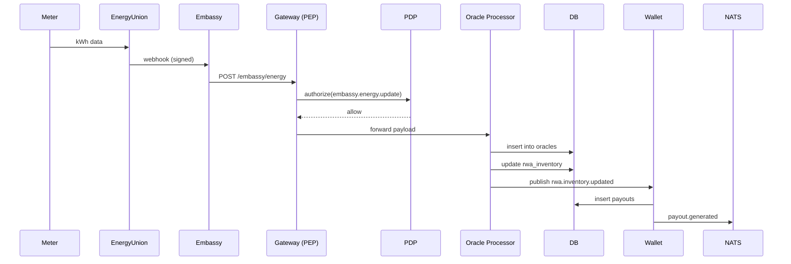

# 40 — RWA Energy, Food, Water Flow Specifications (MicroDAO)

*Потоки RWA (Real-World Assets): енергія, їжа, вода. Embassy інтеграція. Oracle-потоки. Токенізація KWT/1T. Верифікація. Платежі. Аудит.*

---

## 1. Purpose & Scope

Документ визначає:

- як DAARION.city інтегрує реальні фізичні активи (RWA),
- які дані проходять через Embassy,
- як обробляються вимірювання енергії/врожаю/води,
- формат орієнтирів (oracle payloads),
- як оновлюється `rwa_inventory`,
- як це конвертується в KWT/1T виплати,
- які правила безпеки та аудиту.

Це критична частина економічного ядра.

---

## 2. Supported RWA Domains

DAARION.city на рівні MVP підтримує 3 види RWA:

| Домен           | Опис                                  | Платформа   |
| --------------- | ------------------------------------- | ----------- |
| Energy (kWh)    | виробництво та споживання енергії     | EnergyUnion |
| Food (kg/units) | продукти харчування (агро, GreenFood) | GREENFOOD   |
| Water (m³)      | вода, фільтрація, очищення            | WaterUnion  |

Кожен домен має власні:

- сенсори/джерела даних,
- Embassy-канали,
- unit of measure,
- payout формулу.

---

## 3. Data Flow Overview

```text
Device/Meter → Platform (GREENFOOD/EnergyUnion/WaterUnion) → Embassy → API Gateway → PDP → RWA Inventory → Wallet
```

Події в NATS:

- `embassy.energy.update`
- `embassy.food.update`
- `embassy.water.update`
- `oracle.reading.published`
- `rwa.inventory.updated`
- `payout.generated`

---

## 4. Embassy Integration

Embassy — це trusted шлюз між DAARION та платформами RWA.

### 4.1 Authentication

Усі платформи надсилають webhook-запити:

```text
POST /embassy/<domain>
```

З заголовками:

```text
X-Platform-Id: energyunion
X-Timestamp: 1700000000
X-Signature: HMAC_SHA256(payload, secret)
```

Gateway перевіряє:

- HMAC → valid
- timestamp → ±5 хв
- platform → відома
- key → active

Після валідації → PDP(authorize):

```text
action = embassy.energy.update
subject = emb_<platform_id>
```

---

## 5. Oracle Payload Specification

Усі орієнтири мають однакову структуру:

```json
{
  "source": "energyunion",
  "domain": "energy",
  "site_id": "EU-KYIV-01",
  "unit": "kwh",
  "value": 126.45,
  "ts": "2025-11-14T12:00:00Z",
  "signature": "<platform-signature>"
}
```

### Поля:

- `source`: назва платформи
- `domain`: energy | food | water
- `site_id`: унікальний ID локації
- `unit`: kwh | kg | m3
- `value`: величина RWA
- `ts`: timestamp фактичного виміру
- `signature`: підпис платформи (опціонально окремо від HMAC)

---

## 6. RWA Inventory Table Schema

```sql
create table rwa_inventory (
  id text primary key,
  domain text,             -- energy / food / water
  site_id text,
  unit text,               -- kwh / kg / m3
  value numeric,
  value_delta numeric,     -- різниця vs попереднього
  ts timestamptz,
  platform text,
  created_at timestamptz default now()
);
```

---

## 7. Processing Flow for Each Domain

### 7.1 ENERGY Domain

#### Одиниця:

**kWh**

#### Джерела:

- сонячні панелі,
- біогазові станції,
- інвертори.

#### Потік:

1. Device → EnergyUnion
2. EnergyUnion → Embassy (`POST /embassy/energy`)
3. Gateway:
   - HMAC validate
   - PDP(authorize embassy.energy.update)
4. Oracle Processor → таблиця `oracles`
5. Delta обчислення:

   ```text
   delta = current_kwh - previous_kwh
   ```

6. Update `rwa_inventory`
7. Publish `rwa.inventory.updated (energy)`
8. Wallet Service:
   - конвертує kWh → KWT (токен енергії)
   - нараховує payouts (KWT або 1T залежно від політик)

---

### 7.2 FOOD Domain

#### Одиниця:

**kg** або **units** (залежно від товару)

#### Джерела:

- агропідприємства,
- ферми,
- парники,
- склади GreenFood.

#### Потік:

1. GREENFOOD → Embassy (`POST /embassy/food`)
2. Gateway → PDP
3. Oracle Processor:
   - normalize units
   - validate ranges (не може бути -100 або +1e9)
4. Update `rwa_inventory`
5. Publish `rwa.inventory.updated (food)`
6. Wallet Service:
   - може нараховувати 1T для food supply chain (опційно)

---

### 7.3 WATER Domain

#### Одиниця:

**m³**

#### Джерела:

- фільтрувальні станції,
- водні вузли,
- лічильники споживання.

Потік аналогічний:

1. WaterUnion → Embassy (`/embassy/water`)
2. Gateway → PDP
3. Oracle Processor
4. Update `rwa_inventory`
5. Publish event
6. Wallet Service payout (за політиками міста)

---

## 8. KWT / 1T Tokenization Rules

### 8.1 ENERGY → KWT

Формула:

```text
KWT = kWh × conversion_rate
```

`conversion_rate` встановлюється Governance.

### 8.2 FOOD → 1T (optional)

Може працювати як subsidy:

```text
1T = kg × food_bonus_rate
```

### 8.3 WATER → 1T/KWT (mixed)

```text
1T = m3 × water_treatment_reward
```

або:

```text
KWT = m3 × (energy_equivalent)
```

---

## 9. Wallet Integration

При кожному `rwa.inventory.updated`:

Wallet Service:

1. Перевіряє політику:
   - reward type: KWT / 1T / NONE
   - conversion rate
2. Обчислює payout:

   ```text
   payout = delta_value × reward_rate
   ```

3. Генерує запис у `payouts`:

   ```sql
   insert into payouts (team_id, value, symbol, rwa_ref)
   ```

4. Публікує:

   ```text
   payout.generated
   ```

---

## 10. Governance-Controlled Parameters

Governance може:

- міняти `conversion_rate` для кожного домену;
- встановлювати максимальний reward per day;
- вимикати певні reward-и тимчасово;
- встановлювати девіаційні фільтри (anomaly filters);
- встановлювати правила верифікації (multi-oracle consensus).

---

## 11. Anomaly Detection & Anti-Fraud

Базові правила для відхилення аномалій:

### 11.1 Value Constraints

- kWh не може рости на >500% за 1 годину.
- food (kg) не може бути негативною величиною.
- water (m³) не може мати spikes >100x.

### 11.2 Site Consistency

Якщо site передає дані 3 рази на годину, а потім 1 раз у хвилину — вмикається throttling.

### 11.3 Signature Verification

Дані мають бути підписані платформою.

---

## 12. Oracle Processor Rules

Oracle Processor:

- нормалізує величини,
- сортує за ts,
- шукає відсутні delta-записи,
- фільтрує аномалії,
- додає дані в `oracles`,
- створює RWA inventory updates.

---

## 13. Data Retention

### 13.1 Oracles

- зберігаються 2–5 років.

### 13.2 RWA Inventory

- зберігається 3–7 років.

### 13.3 Embassy Logs

- зберігаються 90–180 днів.

---

## 14. Critical Security Rules

- Embassy keys не повинні мати розширених прав.
- Немає прямого доступу до Wallet.
- Немає можливості змінити історію RWA.
- PDP перевіряє:

  ```text
  embassy.<domain>.update
  ```

- Gateway відкидає:
  - запити без HMAC,
  - запити з старим timestamp,
  - підозрілі spikes.

---

## 15. Example End-to-End Flow (Energy)



---

## 16. Integration with Other Docs

Цей документ доповнює:

- `28_flows_wallet_embassy_energy_union.md`
- `33_api_gateway_security_and_pep.md`
- `32_policy_service_PDP_design.md`
- `DAARION_city_platforms_catalog.md`
- `27_database_schema_migrations.md`

---

## 17. Завдання для Cursor

```text
You are a senior backend engineer. Implement RWA Energy, Food, Water Flow Specifications using:
- 40_rwa_energy_food_water_flow_specs.md
- 28_flows_wallet_embassy_energy_union.md
- 33_api_gateway_security_and_pep.md

Tasks:
1) Create Embassy webhook endpoints (/embassy/energy, /embassy/food, /embassy/water).
2) Implement HMAC signature validation for Embassy webhooks.
3) Create Oracle Processor service (normalize, validate, filter anomalies).
4) Implement RWA Inventory updates (delta calculation, insert/update).
5) Create Wallet integration for RWA payouts (KWT/1T tokenization).
6) Add anomaly detection rules (value constraints, site consistency, signature verification).
7) Implement Governance-controlled parameters (conversion rates, reward limits).
8) Add data retention policies (oracles, RWA inventory, Embassy logs).
9) Create NATS events (embassy.energy.update, embassy.food.update, embassy.water.update, rwa.inventory.updated, payout.generated).
10) Add PDP authorization checks for embassy.<domain>.update.

Output:
- list of modified files
- diff
- summary
```

---

## 18. Summary

Потоки RWA у DAARION.city:

- дозволяють токенізувати енергію (KWT), їжу та воду (1T/KWT),
- працюють через Embassy як secure gateway,
- використовують oracles для перевірки та нормалізації даних,
- контролюються Governance для стійкої економіки,
- створюють payouts через Wallet Service,
- повністю логуються,
- захищені від аномалій, підробок і повторних атак.

Це — **серце економічного механізму міста DAARION**.

---

**Версія:** 1.0  
**Останнє оновлення:** 2024-11-14


