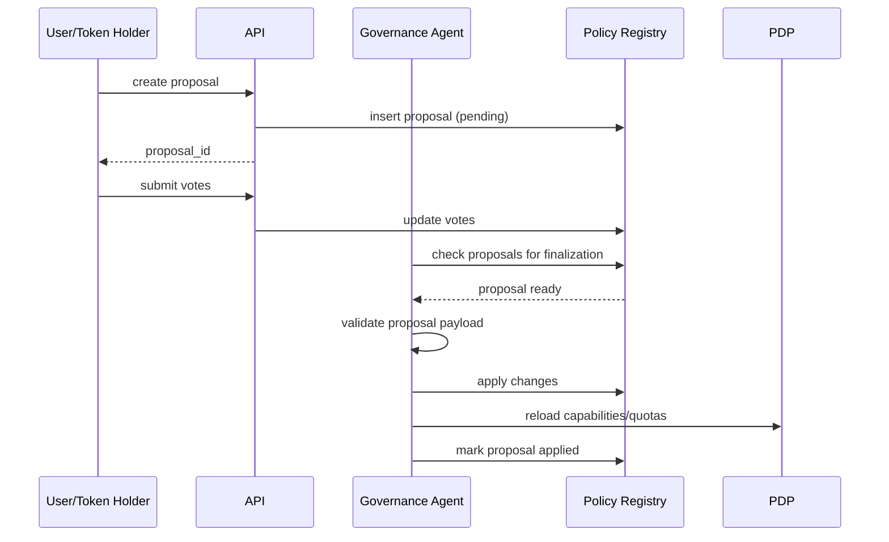

# 41 — AI Governance Agent Design (MicroDAO)

*Специфікація AI Governance Agent: політики, голосування, застосування правил, оновлення capability/bundle/quotas, безпека, журналювання, інтеграція з PDP та Registry*

---

## 1. Purpose & Scope

AI Governance Agent — це **суверенний системний агент**, який:

- приймає та опрацьовує governance proposals,
- перевіряє їх коректність,
- обчислює результати голосування,
- застосовує зміни до Policy Registry,
- оновлює bundles, capabilities, entitlements, stake-multipliers,
- взаємодіє з PDP,
- гарантує консистентність і безпеку системи.

Це **центральний мозок політик** DAARION.city.

---

## 2. Governance Model Overview

Система складається з:

- **Governance Token Holders (DAAR/DAARION)**
- **AI Governance Agent**
- **Policy Registry**
- **Capability Registry**
- **Quota Service**
- **PDP**
- **Audit Log**

Основний принцип:

```text
AI Governance Agent — це механічний виконавець волі DAO.
```

Він сам **не генерує політик**, а лише обробляє та застосовує.

---

## 3. Governance Proposal Lifecycle



---

## 4. Governance Proposal Structure

Зберігається у таблиці `governance_policies`.

Приклад:

```json
{
  "policy_id": "gov_0012",
  "policy_type": "plan.entitlement.update",
  "target": "plan.Premium",
  "operations": [
    { "op": "set_quota", "metric": "llm_tokens_per_month", "value": 3500000 },
    { "op": "increase_quota", "metric": "agent_runs_per_day", "value": 200 }
  ],
  "proposed_by": "u_123",
  "voting_end": "2025-11-20T00:00:00Z"
}
```

---

## 5. Governance Agent Responsibilities

### 5.1 Validation

Перевіряє:

- формат політики,
- чи існує bundle/cap/plan,
- чи операції не суперечать безпековим правилам,
- чи не роблять escalation.

### 5.2 Voting Finalization

Після дедлайну:

- рахує голоси,
- перевіряє кворум,
- визначає результат.

### 5.3 Applying Policy

Головна роль:

- оновити bundles/capabilities/entitlements,
- оновити Registry,
- створити подію `governance.policy.updated`,
- скинути кеш PDP.

### 5.4 Audit

Записує:

- хто подав,
- хто голосував,
- коли застосовано,
- які зміни внесено.

### 5.5 Failure Recovery

У разі помилок:

- застосовує rollback-strategy,
- помічає політику як failed.

---

## 6. Governance Agent Internal Architecture

```text
Governance Agent
    ├── Policy Validator
    ├── Voting Engine
    ├── Policy Applicator
    ├── Registry Updater
    ├── PDP Connector
    ├── Event Publisher
    └── Audit Logger
```

---

## 7. Policy Validation Rules

Головний блок — **Validation Engine**.

### 7.1 Format validation

- JSON schema must match.
- All required fields exist.

### 7.2 Capability rules

- capability must exist in `capabilities`.
- cannot assign admin caps to visitors.
- cannot remove baseline capabilities from Owner/Guardian.

### 7.3 Plan/Entitlements rules

- plan hierarchy is preserved.
- quota cannot be lower than Freemium baseline.
- cannot create infinite cost-free compute.

### 7.4 Stake-multiplier rules

- multiplier ranges must be monotonic.
- cannot set multiplier=0 or negative.

### 7.5 Compute/1T rules

- compute costs must be >= minimum threshold.
- cannot create zero-cost for heavy tools.

### 7.6 RWA policies

- cannot set reward rates above safety ranges.
- cannot autogenerate rewards for unverified RWA.

---

## 8. Voting Engine

Перевіряє:

- голоси,
- токен-вагу,
- кворум,
- approval threshold.

Приклад:

```text
min_quorum = 10% від circulating_supply
approval_required = 51%
```

Після дедлайну:

```text
if quorum_met && approval >= 51%:
     status = approved
else:
     status = rejected
```

---

## 9. Policy Applicator

Застосовує зміни до:

- bundles
- capabilities
- bundle_caps
- plan entitlements
- stake multipliers
- compute pricing
- RWA conversion rates
- platform-level quotas

Алгоритм:

```python
for op in policy.operations:
    apply(op)
validate_consistency()
commit()
publish_event("governance.policy.updated")
```

---

## 10. Registry Integration

### 10.1 Capability Registry

Оновлюються:

- capabilities table,
- bundles,
- bundle_caps.

### 10.2 Quota Registry

Оновлюється JSON конфіг ентитлментів:

```json
{
  "plan.Premium": {
    "llm_tokens_per_month": 3500000,
    "agent_runs_per_day": 1000
  }
}
```

### 10.3 Stake Registry

Оновлюються множники для RINGK.

### 10.4 RWA Registry

Оновлюються conversion rates:

- energy → KWT
- water → 1T
- food → 1T

---

## 11. PDP Integration

Після застосування політики Governance Agent публікує:

```text
governance.policy.updated
```

PDP:

- скидає кеш capabilities,
- скидає кеш entitlements,
- оновлює compute pricing,
- оновлює stake multipliers,
- застосовує нові access rules.

---

## 12. Security Rules (Critical)

### 12.1 Governance Agent cannot modify DB directly

Усе через:

- internal service keys,
- capability: `service.governance.apply`.

### 12.2 Cannot bypass Validation Engine

Будь-яка спроба → automatic deny.

### 12.3 Cannot assign itself new capabilities

Strict no-self-escalation.

### 12.4 Immutable History

Після `applied=true` політика не може бути змінена.

### 12.5 Governance Agent cannot break economic model

Заборонено:

- знизити compute cost нижче min,
- встановити reward rate за RWA > максимум.

---

## 13. Error Recovery

### 13.1 If validation fails

- політика `status=invalid`.

### 13.2 If apply fails

- rollback to pre-apply snapshot,
- mark policy `failed`.

### 13.3 If PDP reload fails

- retry with exponential backoff,
- system enters "safe mode".

---

## 14. Transparency & Audit

Усі операції Governance Agent:

- логуються,
- підписуються service identity,
- зберігаються у `audit_log`,
- доступні для перегляду через:

```text
GET /governance/policies
GET /governance/policies/:id
```

---

## 15. Governance Agent Runtime

### 15.1 Frequency

Agent запускається:

- кожні 60 секунд (плановий цикл),
- або по події «proposal.pending».

### 15.2 Autoscaling

- stateless service,
- масштабування необмежене.

---

## 16. Example Policy Application (Full)

### Input proposal:

```text
Increase Premium compute quotas by 25%
```

### Operations:

```json
[
  { "op": "increase_quota", "metric": "agent_runs_per_day", "value": 250 },
  { "op": "increase_quota", "metric": "llm_tokens_per_month", "value": 500000 }
]
```

### Governance Agent process:

1. validate structure → OK
2. validate quotas do not exceed global max → OK
3. check plan hierarchy → OK
4. commit changes → DB updated
5. publish `policy.updated`
6. PDP reloads → new quotas active

---

## 17. Integration with Other Docs

Цей документ доповнює:

- `31_governance_policies_for_capabilities_and_quotas.md`
- `32_policy_service_PDP_design.md`
- `24_access_keys_capabilities_system.md`
- `30_cost_optimization_and_token_economics_infrastructure.md`
- `40_rwa_energy_food_water_flow_specs.md`

---

## 18. Завдання для Cursor

```text
You are a senior backend engineer. Implement AI Governance Agent using:
- 41_ai_governance_agent_design.md
- 31_governance_policies_for_capabilities_and_quotas.md
- 32_policy_service_PDP_design.md

Tasks:
1) Create Governance Agent service architecture (Policy Validator, Voting Engine, Policy Applicator, Registry Updater, PDP Connector, Event Publisher, Audit Logger).
2) Implement Governance Proposal Lifecycle (create, vote, finalize, apply).
3) Create Governance Proposal Structure (JSON schema).
4) Implement Policy Validation Rules (format, capability, plan/entitlements, stake-multiplier, compute/1T, RWA policies).
5) Implement Voting Engine (vote counting, quorum check, approval threshold).
6) Implement Policy Applicator (apply operations to bundles, capabilities, entitlements, quotas).
7) Add Registry Integration (Capability Registry, Quota Registry, Stake Registry, RWA Registry).
8) Implement PDP Integration (reload capabilities/quotas after policy update).
9) Add Security Rules (no direct DB access, no bypass validation, no self-escalation, immutable history, economic model protection).
10) Implement Error Recovery (validation failure, apply failure, PDP reload failure).
11) Add Transparency & Audit (logging, service identity signing, audit_log storage).
12) Create Governance Agent Runtime (periodic execution, event-driven triggers).

Output:
- list of modified files
- diff
- summary
```

---

## 19. Summary

AI Governance Agent:

- керує всіма політиками DAARION.city,
- контролює capability-набори,
- регулює квоти та економіку,
- гарантує безпеку та непротирічність,
- забезпечує прозорість і аудитність,
- інтегрується з PDP/PEP/Registry/NATS,
- виконує волю резидентів DAO,
- є однією з найважливіших служб у системі.

Це — **архітектурне серце управління DAARION OS**.

---

**Версія:** 1.0  
**Останнє оновлення:** 2024-11-14


