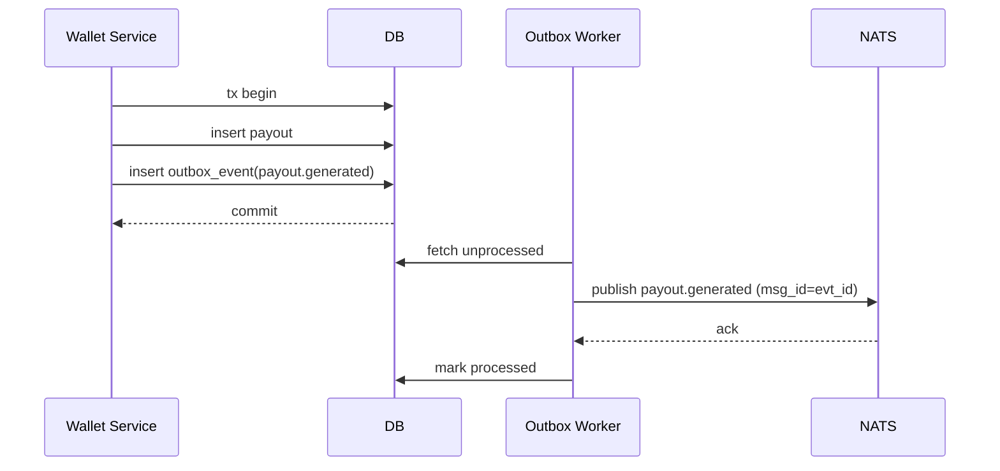

# 43 — Database Events Outbox Design (MicroDAO)

*Outbox Pattern: транзакційна доставка подій, таблиця outbox_events, воркери, дедуплікація, retry, backpressure, інтеграція з NATS JetStream*

---

## 1. Purpose & Scope

Outbox Pattern вирішує проблему:

> Як гарантувати, що подія завжди буде доставлена у NATS без втрати даних, навіть якщо сервіс або NATS відмовили?

Цей документ визначає:

- структуру `outbox_events`,
- процес вставки,
- воркерів,
- правила retry/backoff,
- дедуплікацію,
- atomic commit,
- safety механізми,
- інтеграцію з JetStream.

---

## 2. Why Outbox Pattern Is Required

У DAARION.city outbox використовується для:

- agent-run events,
- payouts,
- staking,
- wallet tx,
- embassy updates,
- oracle readings,
- governance updates,
- usage increments.

Причини:

- JetStream може бути недоступним у момент транзакції.
- Сервіси не повинні втрачати події.
- Потрібно гарантувати idempotency.
- Потрібно відокремити business logic від доставки.

---

## 3. Outbox Table Schema

```sql
create table outbox_events (
  id text primary key,
  stream text not null,                -- e.g. STREAM_RWA
  topic text not null,                 -- e.g. rwa.inventory.updated
  payload jsonb not null,
  created_at timestamptz default now(),
  processed bool default false,
  processed_at timestamptz,
  error text                           -- optional failure reason
);
```

### Вимоги:

- `id` генерується UUID або snowflake.
- Рядки **ніколи не видаляються** (тільки retention archive).
- `processed=false` означає «готовий до доставки».

---

## 4. Outbox Event Insertion

Подія вставляється у **тій самій транзакції**, що і бізнес-операція.

Приклад (псевдо):

```sql
BEGIN;

UPDATE payouts SET status='generated' WHERE id='p_001';

INSERT INTO outbox_events (
    id, stream, topic, payload
) VALUES (
    gen_id(), 
    'STREAM_PAYOUT',
    'payout.generated',
    '{"payout_id":"p_001","team_id":"t_555"}'::jsonb
);

COMMIT;
```

Гарантія:

- якщо COMMIT відбувся → подія потрапила у Outbox.
- якщо COMMIT не відбувся → подія не існує.

---

## 5. Outbox Worker Architecture

```text
Outbox Worker →
    SELECT * FROM outbox_events
    WHERE processed=false
    ORDER BY created_at
    LIMIT 200;

for each event:
    TRY publish to NATS
    ON success → mark processed
    ON failure → retry later
```

Workers можуть бути:

- 1..N штук,
- статично або auto-scaled,
- у Mesh під mTLS.

---

## 6. Worker Processing Loop

```python
while true:
    events = db.fetch_unprocessed(limit=200)

    for evt in events:
        try:
            nats.publish(evt.topic, evt.payload)
            db.mark_processed(evt)
        except NATSDownError:
            sleep(backoff)
            continue
        except ValidationError:
            db.mark_error(evt, "invalid payload")
            continue
```

---

## 7. Deduplication

Необхідно витримати **at-least-once**, але уникати дублювань:

- JetStream має natural dedupe по `msg_id`
- Outbox Worker використовує:

```text
NATS header: Nats-Msg-Id = outbox_event_id
```

Приклад:

```python
nats.publish(
  topic,
  payload,
  headers={"Nats-Msg-Id": evt.id}
)
```

JetStream не доставить дубль.

---

## 8. Retry Strategy

### 8.1 Backoff

Експоненційний:

```text
1s → 2s → 4s → 8s → 16s → max 60s
```

### 8.2 Dead-letter Condition

Після X помилок:

```text
processed=false
error="unrecoverable"
```

worker перестає ретрити; адміністратор розбирається вручну.

---

## 9. Batch Processing & Throughput

### Рекомендації:

- batch size: 100–300 подій
- 2–10 worker replicas
- автоматичний autoscaling по lag:
  - якщо кількість `processed=false` > 10,000 → scale up

---

## 10. Event Ordering Rules

Outbox Worker дотримується ordering:

- per stream
- per partition key (custom)

Порядок подій важливий для:

- payouts
- RWA updates
- governance

---

## 11. Multi-Stream Routing

Сервіс визначає stream:

```text
if topic startswith "agent.run":
    stream = STREAM_AGENT_RUN

if topic startswith "embassy":
    stream = STREAM_EMBASSY
```

Усі стріми повинні бути попередньо створені:

```json
{
  "name": "STREAM_RWA",
  "subjects": ["rwa.inventory.*"],
  "replicas": 3,
  "storage": "file"
}
```

---

## 12. Failure Modes

### 12.1 Worker Crash

Рішення:

- worker restart → обробляє далі.

### 12.2 Database Down

Outbox Worker призупиняється → не доставляє події.

### 12.3 NATS Down

Worker робить retry до відновлення.

### 12.4 Corrupted Payload

Worker позначає `error` і пропускає подію.

---

## 13. Safety Guarantees

Outbox забезпечує:

- **atomicity**
- **consistency**
- **at-least-once**
- **no-loss**
- **event replayability**
- **jetstream dedupe**
- **idempotent consumers**

---

## 14. Event Consumer Rules

Кожен сервіс, що слухає події, дотримується:

- idempotency (повтор повинен не ламати логіку),
- durable consumer,
- manual ack,
- retry on failure,
- trace_id propagation.

---

## 15. Operational Metrics

Моніторимо:

- outbox_events total count
- unprocessed count
- processing rate
- worker lag
- NATS publish latency
- error rate

---

## 16. Backpressure Control

Якщо worker не встигає:

- автоматичний autoscaling,
- або backpressure для producer services (м'яке гальмування).

---

## 17. Batch Deletion / Archival

Outbox події можуть бути:

- заархівовані після 90–365 днів,
- переведені у cold storage (S3),
- видалені після 3 років (policy-dependent).

---

## 18. Example End-to-End Flow (Payout)



---

## 19. Integration with Other Docs

Цей документ доповнює:

- `42_nats_event_streams_and_event_catalog.md`
- `27_database_schema_migrations.md`
- `34_internal_services_architecture.md`
- `29_scaling_and_high_availability.md`

---

## 20. Завдання для Cursor

```text
You are a senior backend engineer. Implement Database Events Outbox Design using:
- 43_database_events_outbox_design.md
- 42_nats_event_streams_and_event_catalog.md
- 27_database_schema_migrations.md

Tasks:
1) Create outbox_events table schema (id, stream, topic, payload, created_at, processed, processed_at, error).
2) Implement Outbox Event Insertion (atomic transaction with business logic).
3) Create Outbox Worker service (fetch unprocessed, publish to NATS, mark processed).
4) Implement Worker Processing Loop (batch processing, error handling).
5) Add Deduplication (NATS header Nats-Msg-Id = outbox_event_id).
6) Implement Retry Strategy (exponential backoff, dead-letter condition).
7) Configure Batch Processing & Throughput (batch size 100-300, autoscaling).
8) Add Event Ordering Rules (per stream, per partition key).
9) Implement Multi-Stream Routing (topic → stream mapping).
10) Handle Failure Modes (worker crash, database down, NATS down, corrupted payload).
11) Add Safety Guarantees (atomicity, consistency, at-least-once, no-loss, replayability).
12) Define Event Consumer Rules (idempotency, durable consumer, manual ack, retry, trace_id).
13) Add Operational Metrics (outbox_events count, unprocessed count, processing rate, worker lag, NATS latency, error rate).
14) Implement Backpressure Control (autoscaling, producer backpressure).
15) Add Batch Deletion / Archival (90-365 days archive, S3 cold storage, 3 years deletion).

Output:
- list of modified files
- diff
- summary
```

---

## 21. Summary

Outbox Design гарантує:

- надійну доставку подій у JetStream,
- 100% уникнення втрати даних,
- консистентність життєво важливих RWA/payout/embassy процесів,
- контрольовану доставку у high-load,
- retry/backoff без дублювань,
- зручну діагностику й моніторинг.

Це — **основний транспортний транзакційний шар DAARION OS**.

---

**Версія:** 1.0  
**Останнє оновлення:** 2024-11-14


