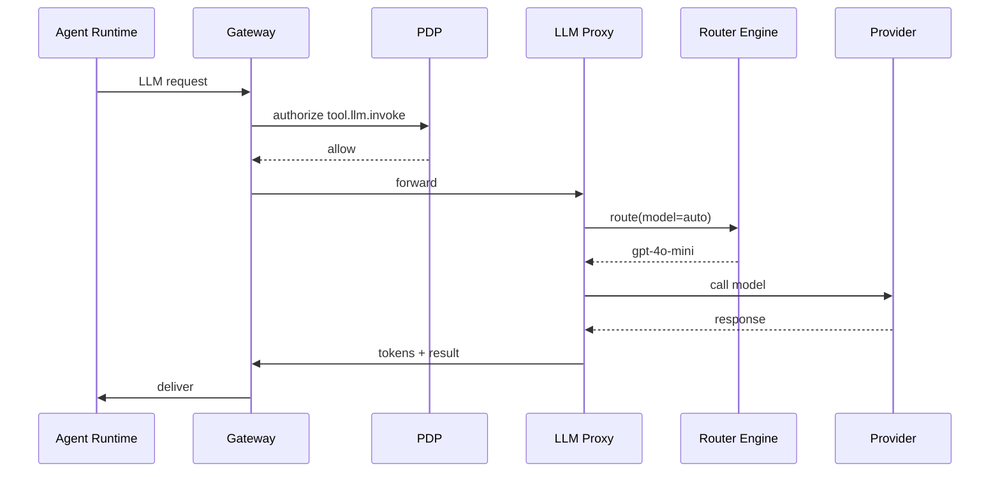

# 45 — LLM Proxy & Multi-Model Routing (MicroDAO)

*LLM Proxy: маршрутизація моделей, cost control, токени, PDP, sandbox, autoscaling, fallback-логіка, multimodel orchestration*

---

## 1. Purpose & Scope

LLM Proxy — це **єдина точка** взаємодії DAARION.city з усіма LLM:

- OpenAI
- Anthropic
- Local models
- Vision models
- Embeddings
- Code models
- Audio (ASR/TTS)

Він:

- нормалізує API,
- викликає правильну модель,
- керує витратами,
- обмежує usage,
- запускає fallback,
- дає PDP-контроль,
- маскує системні інструкції,
- приховує chain-of-thought.

---

## 2. High-Level Architecture

```text
Agent / Router / Tools
         ↓
      API Gateway (PEP)
         ↓
       LLM Proxy
         ↓
 Multi-Model Router Engine
         ↓
 Providers / Local Models / Vision / Embeddings
```

---

## 3. Why Not Call LLM Directly?

LLM Proxy — єдиний спосіб гарантувати:

- безпеку (PDP checks),
- облік usage,
- стале ціноутворення,
- контроль cost explosion,
- фільтрацію危险 prompt-ів,
- policy-based routing (cheap → medium → best),
- інституційну інтеграцію policy-рівня.

Жоден агент, сервіс чи tool **не має прямого доступу** до LLM API.

---

## 4. Core Responsibilities

- маршрутизація між моделями
- облік токенів
- облік вартості (1T)
- ліміти usage
- fallback до дешевших моделей
- нормалізація інтерфейсів
- конфіденційність (при confidential mode)
- безпека (prompt sanitizer)
- логування
- autoscaling воркерів
- дотримання governance-політик

---

## 5. Supported Model Types

### 5.1 Text models

- gpt-4.1-mini
- gpt-4o
- sonnet
- local LLaMA xB
- Mistral інструктажні

### 5.2 Vision models

- gpt-4o-vision
- llava-v1.6
- open-clip inference

### 5.3 Embeddings

- text-embedding-3-small
- local embeddings BGE-large

### 5.4 Code Models

- gpt-o1
- Claude Code
- local starcoder

### 5.5 Audio

- Whisper
- Local ASR/TTS

---

## 6. Normalized Request Schema

Усі LLM запити приходять у форматі:

```json
{
  "model": "auto|gpt-4o-mini|sonnet",
  "messages": [...],
  "max_tokens": 4096,
  "temperature": 0.5,
  "tools": [...],
  "context": {
    "team_id": "t_555",
    "agent_run_id": "ar_001",
    "confidential": false
  }
}
```

---

## 7. Routing Modes

### 7.1 Mode A — DIRECT

Використати точно зазначену модель.

### 7.2 Mode B — TIERED ROUTING

```text
cheap → balanced → premium
```

Приклад логіки:

```text
Якщо контекст короткий → gpt-4o-mini
Якщо потрібний reasoning → gpt-4o
Якщо треба vision → gpt-4o-vision
```

### 7.3 Mode C — Specialized

- код → code model
- embeddings → embedding model
- vision → vision pipeline

---

## 8. Fallback Logic

1. Якщо модель 503/timeout:

   ```text
   fallback to same-tier alternative
   ```

2. Якщо токени не поміщаються:

   ```text
   fallback to compression (summaries)
   ```

3. Якщо залишився малий бюджет 1T:

   ```text
   fallback to cheaper model
   ```

---

## 9. Prompt Sanitization Layer

Перед викликом моделі LLM Proxy:

- видаляє інструкції, що намагаються зняти обмеження,
- фільтрує injections:

  ```text
  ignore previous instructions
  ```

- видаляє відомі jailbreak patterns,
- шифрує або редагує конфіденційні частини,
- перетворює спецсимволи.

---

## 10. Confidential Mode

Якщо у контексті:

```text
confidential = true
```

Тоді LLM Proxy:

- ховає/редагує plaintext,
- подає тільки summary/embeddings,
- забороняє інструменти з full text,
- вимикає vision (бо містить raw data).

---

## 11. PDP Integration

Перед виконанням:

```text
PDP(authorize tool.llm.invoke)
```

Після — Usage Engine:

```text
usage.llm.increment(tokens)
cost_1t = tokens * price
quota.check()
```

---

## 12. Token Counting

Підтримуються:

- exact token count
- pre-count estimation
- streaming token accumulation

LLM Proxy повертає:

```json
"usage": {
  "prompt_tokens": 1321,
  "completion_tokens": 552,
  "total_tokens": 1873
}
```

---

## 13. Cost Calculation (1T Integration)

```text
cost_1t = total_tokens × model_price
```

*model_price* задається Governance.

Зберігається у:

- usage counters,
- agent run summary,
- analytics.

---

## 14. Multi-Model Orchestration

Підтримує:

### 14.1 Router-Style Chains

```text
step 1 → llm-mini
step 2 → llm-large
step 3 → embeddings
step 4 → llm-mini
```

### 14.2 Vision → Reasoning flow

```text
image → vision encoder → LLM → tools → report
```

### 14.3 Agents → Tools → LLM → Memory

---

## 15. Error Model

LLM Proxy повертає:

| Code                       | Meaning                         |
| -------------------------- | ------------------------------- |
| llm_timeout                | провайдер не відповів           |
| llm_over_quota             | usage > quota                   |
| llm_confidential_violation | текст неможливо подати в модель |
| llm_model_unavailable      | модель недоступна               |
| llm_input_too_large        | не поміщається у контекст       |
| llm_safety_block           | jailbreak / unsafe              |

---

## 16. Retry / Timeouts

### Timeouts:

- mini models: 10–25s
- main models: 25–60s
- vision: 45–90s

### Retry:

- кожну помилку класифікує Router Engine,
- retry через 1–5 секунд,
- не більше 2 разів.

---

## 17. Model Selection Logic (Pseudo)

```python
if model == "auto":
    if request.has_images:
        return "gpt-4o-vision"
    if request.tokens < 2000:
        return "gpt-4o-mini"
    if request.requires_reasoning:
        return "gpt-4o"
    return "sonnet"
else:
    return model
```

---

## 18. Local Model Constraints

Local LLaMA/mistral використовуються коли:

- confidential mode активний,
- cost override,
- автономна інфраструктура (offline mode).

Обмеження:

- контекст менше,
- reasoning слабший,
- відповіді короткі,
- інструменти зведені до мінімуму.

---

## 19. Autoscaling

LLM Proxy має worker pools:

- text workers
- vision workers
- embeddings workers

Autoscaling тригериться:

- queue size
- average latency
- error rate

---

## 20. Logging & Monitoring

Усі виклики LLM Proxy → логуються (без plaintext):

- модель
- тривалість
- токени
- cost
- тип інструменту
- fallback чи ні
- error reason

Метрики в Grafana:

- tokens/minute
- токени per team
- latency p95
- fallback rate
- provider availability

---

## 21. Safety / Guardrails

LLM Proxy забороняє:

- генерувати шкідливі інструкції,
- виконувати код,
- описувати небезпечні дії,
- обхід sandbox,
- інструкції, спрямовані на капітальні зміни політик.

---

## 22. Example Complete Flow



---

## 23. Integration with Other Docs

Цей документ доповнює:

- `11_llm_integration.md`
- `44_usage_accounting_and_quota_engine.md`
- `32_policy_service_PDP_design.md`
- `36_agent_runtime_isolation_and_sandboxing.md`
- `46_router_orchestrator_design.md`

---

## 24. Завдання для Cursor

```text
You are a senior backend engineer. Implement LLM Proxy & Multi-Model Routing using:
- 45_llm_proxy_and_multimodel_routing.md
- 11_llm_integration.md
- 44_usage_accounting_and_quota_engine.md

Tasks:
1) Create LLM Proxy service architecture (Multi-Model Router Engine, Provider interfaces).
2) Implement Normalized Request Schema (unified format for all LLM requests).
3) Add Routing Modes (DIRECT, TIERED ROUTING, Specialized).
4) Implement Fallback Logic (timeout fallback, token compression, budget-based fallback).
5) Add Prompt Sanitization Layer (remove dangerous instructions, filter injections, jailbreak patterns).
6) Implement Confidential Mode (hide/redact plaintext, summary/embeddings only, disable vision).
7) Integrate with PDP (authorize tool.llm.invoke).
8) Add Token Counting (exact count, pre-count estimation, streaming accumulation).
9) Implement Cost Calculation (1T integration, model_price from Governance).
10) Add Multi-Model Orchestration (Router-Style Chains, Vision → Reasoning flow, Agents → Tools → LLM → Memory).
11) Implement Error Model (llm_timeout, llm_over_quota, llm_confidential_violation, llm_model_unavailable, llm_input_too_large, llm_safety_block).
12) Add Retry / Timeouts (per model type, retry logic).
13) Implement Model Selection Logic (auto routing based on request characteristics).
14) Add Local Model Constraints (confidential mode, cost override, offline mode).
15) Implement Autoscaling (worker pools, queue size, latency, error rate triggers).
16) Add Logging & Monitoring (metrics, Grafana dashboards).
17) Implement Safety / Guardrails (block harmful instructions, code execution, dangerous actions).

Output:
- list of modified files
- diff
- summary
```

---

## 25. Summary

LLM Proxy забезпечує:

- єдиний інтерфейс до всіх моделей,
- нормалізацію API,
- безпеку promptів,
- конфіденційний режим,
- розумне маршрутування,
- fallback,
- облік токенів,
- прогнозовану вартість,
- масштабованість,
- можливість multi-step orchestration,
- захист від зловживань.

Це — **центральний обчислювальний шар всієї системи DAARION OS**.

---

**Версія:** 1.0  
**Останнє оновлення:** 2024-11-14


