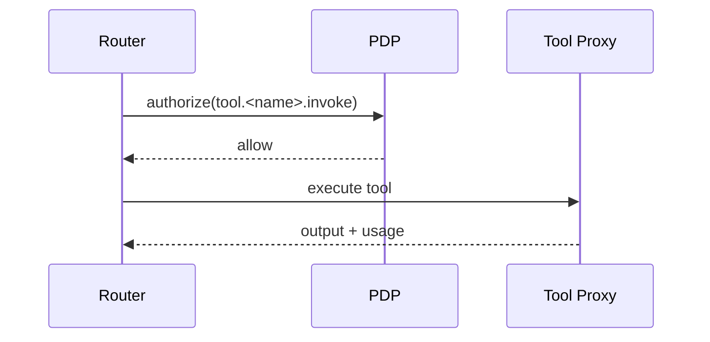
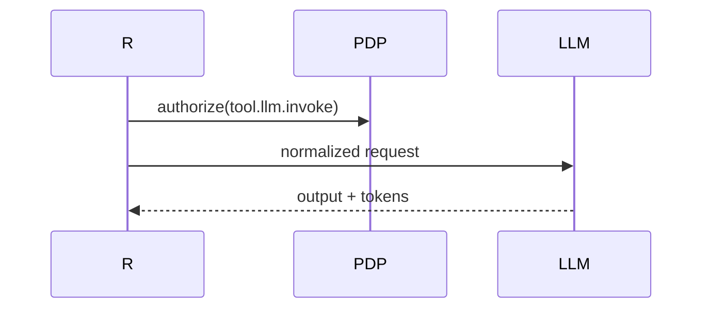
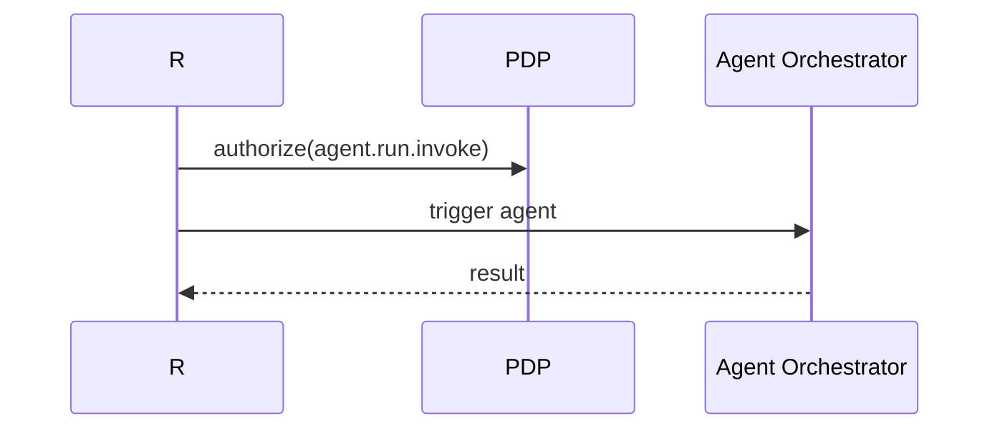

# 46 — Router Orchestrator Design (MicroDAO)

*DAARWIZZ Router: інструментальні маршрути, state machine, контекстні флоу, orchestration, паралелізація, безпека, облік вартості*

---

## 1. Purpose & Scope

DAARWIZZ Router — це **центральна оркестраційна система**, яка:

- розбиває задачі на кроки
- викликає інструменти
- викликає агентів
- викликає LLM Proxy
- обробляє помилки
- зупиняє надмірні флоу
- гарантує дотримання cost / usage / quotas
- забезпечує state machine для multi-step процесів

Це головний механізм **автоматизації процесів** в DAARION.city.

---

## 2. High-Level Architecture

```text
User / Agent / API
        ↓
    Router Orchestrator
        ↓
  Step Engine / State Machine
        ↓
 Tools / Agents / LLM Proxy / Platform Tools
```

---

## 3. Input Specification

Уніфікований формат запиту:

```json
{
  "input": "...",
  "goal": "...",
  "constraints": {...},
  "context": {
    "team_id": "t_444",
    "agent_run_id": "ar_777",
    "confidential": false
  },
  "steps": "auto|structured",
  "tools": ["math","project","llm","greenfood.order"]
}
```

---

## 4. Router Modes

### 4.1 Mode A — AUTO PLAN

Router сам планує кроки (використання лише у продвинутих планах):

```text
Goal → Plan Generation → Step Execution
```

### 4.2 Mode B — STRUCTURED

Користувач/агент визначає точні кроки:

```json
steps: [
  { tool:"project.create", args:{...} },
  { tool:"llm", args:{...} }
]
```

### 4.3 Mode C — HYBRID

AI пропонує план → користувач затверджує → Router виконує.

---

## 5. State Machine Architecture

Router має власний state machine:

```text
INIT
PLAN
EXECUTE_STEP
WAIT_TOOL
WAIT_AGENT
ERROR_RECOVERY
DONE
```

### Переходи:

- INIT → PLAN
- PLAN → EXECUTE_STEP
- EXECUTE_STEP → WAIT_TOOL/WAIT_AGENT
- WAIT_* → EXECUTE_STEP
- EXECUTE_STEP → DONE
- EXECUTE_STEP → ERROR_RECOVERY
- ERROR_RECOVERY → EXECUTE_STEP | DONE

---

## 6. Step Engine

Кожен крок має структуру:

```json
{
  "id": "step_1",
  "type": "tool|agent|llm",
  "tool": "project.create",
  "args": { ... }
}
```

### Типи кроків:

- **LLM** — виклик LLM Proxy
- **Tool** — виклик інструменту
- **Agent** — запуск іншого агента (subagent pattern)
- **Platform** — інтеграція GREENFOOD/EnergyUnion
- **Branch** — умовні гілки (if/else)
- **Parallel** — паралельні підкроки
- **Loop** — повторення (обмежений)

---

## 7. Safety Limits

Обмеження, які Router зобов'язаний виконати:

- max_steps = 50
- max_parallel = 5
- max_total_cost_1t = team_day_limit
- max_wait_time_per_step = 120s
- max_agent_invocations_per_flow = 5
- no recursive router → router

---

## 8. Cost Control

Router виконує pre-estimate:

```text
estimated_cost = sum(step.cost_estimates)
```

Якщо це > quota:

```text
abort + error: cost_limit_exceeded
```

Після кожного кроку:

- оновлюється фактичний cost
- Usage Engine робить ті самі перевірки
- PDP отримує оновлений контекст

---

## 9. Confidential Mode

Router:

- фільтрує plaintext інформацію
- замінює raw → summary
- забороняє vision-кроки
- забороняє tools категорії C/D
- обмежує autonomy планування
- не зберігає input у логах

---

## 10. Tool Execution Flow



---

## 11. LLM Execution Flow



---

## 12. Subagent Execution Flow

Router може викликати агентів, але з обмеженнями:

```text
max_subagents_per_flow = 3
no_chained_subagent → subagent → subagent
```

Flow:



---

## 13. Error Handling

### Типи помилок:

| Type                   | Action           |
| ---------------------- | ---------------- |
| tool_timeout           | retry → skip     |
| llm_timeout            | retry → fallback |
| invalid_args           | fail step        |
| unauthorized           | abort            |
| quota_exceeded         | abort            |
| agent_failed           | skip/abort       |
| branch_condition_error | default-fallback |

### Recovery logic:

```text
on error:
  if retryable → retry 1-2 times
  else break or skip
```

---

## 14. Logging

Router логування (без plaintext):

- steps
- timings
- cost
- tokens
- used tools
- fallback transitions
- error traces

Logs → telemetry + NATS:

```text
router.flow.started
router.flow.completed
router.flow.failed
```

---

## 15. Monitoring

Показники:

- steps/min
- average cost
- retry rate
- failure rate
- parallelism
- queue depth

---

## 16. Platform Tool Integration (Energy/Food/Water)

Router може викликати:

```text
tool.greenfood.order
tool.energy.read
tool.water.read
```

Умови:

- PDP must allow
- confidential mode → redacted
- no mass platform actions (>10 per flow)

---

## 17. Parallel Steps

Router може виконувати групи:

```json
{
  "type": "parallel",
  "steps": [
    {"type":"llm", ...},
    {"type":"tool", ...}
  ]
}
```

Завершення:

- всі успішні → success
- будь-який критичний failure → abort

---

## 18. Branch Logic

```json
{
  "type": "branch",
  "condition": "output.text contains 'yes'",
  "if_true": [...],
  "if_false": [...]
}
```

Оцінка:

- через LLM Proxy (cheap models)

---

## 19. Loop Logic

```text
max_loops = 5
```

Loop без умови → abort.

---

## 20. Full Example Flow

```json
{
  "input": "Створи мені сторінку GreenFood",
  "goal": "Сформувати JSON-структуру і завдання",
  "steps": [
    { "type": "llm", "args": {"task":"extract_requirements"} },
    { "type": "tool", "tool": "project.create", "args": {...} },
    { "type": "parallel", "steps": [
        { "type": "llm", "args": {...} },
        { "type": "tool", "tool": "task.create", "args": {...} }
      ]
    }
  ]
}
```

---

## 21. Integration with Other Docs

Цей документ доповнює:

- `45_llm_proxy_and_multimodel_routing.md`
- `37_agent_tools_and_plugins_specification.md`
- `32_policy_service_PDP_design.md`
- `44_usage_accounting_and_quota_engine.md`
- `40_rwa_energy_food_water_flow_specs.md`

---

## 22. Завдання для Cursor

```text
You are a senior backend engineer. Implement Router Orchestrator Design using:
- 46_router_orchestrator_design.md
- 45_llm_proxy_and_multimodel_routing.md
- 37_agent_tools_and_plugins_specification.md

Tasks:
1) Create Router Orchestrator service architecture (Step Engine, State Machine).
2) Implement Input Specification (unified request format).
3) Add Router Modes (AUTO PLAN, STRUCTURED, HYBRID).
4) Implement State Machine Architecture (INIT, PLAN, EXECUTE_STEP, WAIT_TOOL, WAIT_AGENT, ERROR_RECOVERY, DONE).
5) Create Step Engine (step types: LLM, Tool, Agent, Platform, Branch, Parallel, Loop).
6) Add Safety Limits (max_steps, max_parallel, max_total_cost_1t, max_wait_time_per_step, max_agent_invocations_per_flow, no recursive router).
7) Implement Cost Control (pre-estimate, quota check, actual cost tracking).
8) Add Confidential Mode (filter plaintext, replace raw → summary, disable vision, disable category C/D tools, limit autonomy).
9) Implement Tool Execution Flow (PDP authorization, Tool Proxy integration).
10) Implement LLM Execution Flow (PDP authorization, LLM Proxy integration).
11) Add Subagent Execution Flow (max_subagents_per_flow, no chained subagents).
12) Implement Error Handling (error types, recovery logic, retry mechanism).
13) Add Logging (steps, timings, cost, tokens, tools, fallback, errors).
14) Add Monitoring (steps/min, average cost, retry rate, failure rate, parallelism, queue depth).
15) Implement Platform Tool Integration (GREENFOOD, EnergyUnion, WaterUnion).
16) Add Parallel Steps (parallel execution, success/failure handling).
17) Implement Branch Logic (conditional branches, LLM-based condition evaluation).
18) Add Loop Logic (max_loops, abort on infinite loops).

Output:
- list of modified files
- diff
- summary
```

---

## 23. Summary

DAARWIZZ Router / Orchestrator:

- управляє multi-step AI флоу
- гарантує безпеку кожного кроку
- інтегрує LLM, інструменти, агентів та платформи
- контролює витрати 1T та usage
- виконує state machine
- захищений policy engine
- підтримує branching, loops, parallelism
- працює в confidential mode
- є основою автоматизації у DAARION OS

---

**Версія:** 1.0  
**Останнє оновлення:** 2024-11-14


