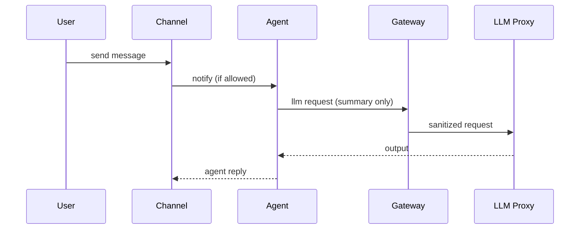

# 47 — Messaging Channels & Privacy Layers (MicroDAO)

*Приватні та командні канали, конфіденційність, ACL, індексація, message lifetimes, agent visibility, редагування, модерація, шифрування*

---

## 1. Purpose & Scope

Цей документ встановлює:

- архітектуру чатів та каналів,
- правила доступу (ACL),
- приватність і confidential mode,
- схему повідомлень,
- правила збереження / ретенції,
- індексацію (без plaintext),
- agent visibility,
- інтеграцію з tools, governance, PDP, LLM Proxy.

Це основа всієї комунікаційної системи DAARION.city.

---

## 2. Messaging Entities

DAARION має три типи комунікаційних просторів:

1. **Direct Messages (DM)**
2. **Team Channels (microDAO)**
3. **System Channels** (log streams, notifications)

---

## 3. Channel Types

### 3.1 DIRECT

- між двома користувачами
- ACL: `user A` + `user B`
- агент має доступ тільки якщо дозволено вручну

### 3.2 TEAM PUBLIC

- доступні всій команді
- бачать усі користувачі + Agent Manager

### 3.3 TEAM PRIVATE

- обмежені `Owner/Guardian` та обрані учасники
- agents → **no access by default**

### 3.4 CONFIDENTIAL CHANNEL

**Найвищий рівень приватності:**

- plaintext не індексується
- plaintext не передається агентам
- plaintext не зберігається в logs
- LLM Proxy отримує тільки summary/embeddings
- Router не може виконувати vision-кроки

---

## 4. Channel Schema

```sql
create table channels (
  id text primary key,
  team_id text,
  type text,       -- direct, team_public, team_private, confidential
  name text,
  created_by text,
  created_at timestamptz,
  updated_at timestamptz
);
```

---

## 5. Message Schema

```sql
create table messages (
  id text primary key,
  channel_id text,
  sender_id text,
  sender_type text,       -- user|agent|system
  body_summary text,      -- plaintext summary (clean)
  body_embedding vector,  -- embedding
  body_raw text,          -- encrypted E2EE blob (optional)
  reply_to text,
  created_at timestamptz,
  updated_at timestamptz
);
```

**ВАЖЛИВО:**

`body_raw` ніколи не зберігається у plaintext, тільки як зашифрований blob (або порожнє поле в confidential mode).

---

## 6. E2EE Model (Optional Layer)

E2EE може бути:

- увімкнений на канал,
- увімкнений користувачем,
- увімкнений командою.

E2EE робить:

- `body_raw` → AES-256-GCM
- Encryption keys → local device
- Server → бачить тільки ciphertext + summary/embeddings

---

## 7. Confidential Mode Rules

Якщо канал має тип `confidential`:

- `body_raw` → optional or must be encrypted
- не зберігається plaintext summary (тільки redacted summary)
- embeddings генеруються з redacted тексту
- агенти не бачать вміст
- LLM Proxy бачить тільки:
  - `summary`
  - high-level metadata
- vision заблокований
- tools категорії C/D → заблоковані
- Router автономія ↓

---

## 8. ACL Model

У кожному каналі:

```text
ACL = { users: [...], agents: [...], roles: [...] }
```

### Roles:

- Owner
- Guardian
- Member
- Guest
- Agent

В ACL обов'язково зазначаються:

- хто може читати
- хто може писати
- хто може надсилати файли
- хто може переглядати історію

Приклад ACL:

```json
{
  "read": ["owner","guardian","member"],
  "write": ["owner","guardian"],
  "agents_allowed": ["ag_777"]
}
```

---

## 9. Agent Visibility Rules

### Default:

Агенти **не мають доступу** до каналів.

### Дозволи:

- Owner/Guardian може додати агента до каналу
- Агент отримує:
  - summaries
  - embeddings
  - metadata
- Не отримує:
  - filesystem attachments
  - raw plaintext
  - vision data
  - files > 1MB

---

## 10. Search Indexing

Система не індексує plaintext.

Індекс формується із:

- `body_summary` (redacted якщо confidential)
- embeddings
- metadata (sender, timestamps, channel)

Search Engine використовує:

- vector search для semantic
- keyword index для metadata

---

## 11. Message Lifecycle

### 11.1 Create

- plaintext → sanitization
- summary → create
- embedding → create
- body_raw → E2EE або skip
- запис у DB
- подія `chat.message.created`

### 11.2 Edit

- новий summary (raw не зберігається)
- подія `chat.message.updated`

### 11.3 Delete

- `body_summary = "[deleted]"`
- embeddings → zero vector
- raw → purged
- подія `chat.message.deleted`

---

## 12. Retention Rules

### Direct Messages

- 30–180 днів

### Team Public

- 30–365 днів

### Team Private

- 90–365 днів

### Confidential

- 0–30 днів (політика команди)

### System Channels

- 90–365 днів

---

## 13. Attachments (Files)

Дозволено, але залежно від каналу:

| Тип каналу   | Макс розмір | Зберігання | Agent Access |
| ------------ | ----------- | ---------- | ------------ |
| direct       | 10MB        | encrypted  | no           |
| team_public  | 25MB        | encrypted  | summary only |
| team_private | 25MB        | encrypted  | no           |
| confidential | 5MB         | encrypted  | no           |

---

## 14. Moderate / Filter System

Система фільтрує:

- небезпечні prompt-інструкції
- sensitive data → summary only
- файли з підозрілим MIME
- external email/password leaks

AI Moderator генерує:

- `message.flagged` події
- автоматичні warnings

---

## 15. Chat → Agent → LLM Proxy Flow



---

## 16. Chat → Router Flow

Router може запускати multi-step flows, але:

- тільки в каналах, що НЕ confidential
- тільки за дозволу каналу (`agents_allowed`)
- не більше 5 flows/hour/channel

---

## 17. System Channels

Система має спеціальні канали:

- `system.audit`
- `system.notifications`
- `system.rwa`
- `system.wallet`
- `system.payouts`
- `system.governance`

Ці канали:

- read-only
- plaintext → summary only
- доступні Owner/Guardian
- агенти не бачать

---

## 18. Governance Controls

Governance може:

- визначати максимальні retention політики
- визначати ACL policy templates
- активувати/деактивувати confidential режим
- визначати, чи агенти можуть бачити summaries
- обмежувати індексацію
- встановлювати file limits

---

## 19. Observability & Telemetry

Метрики:

- messages/hour
- agent participation
- confidential ratio
- flagged messages
- search queries

Логи без plaintext:

- channel actions
- ACL changes
- dangerous content flags

---

## 20. Integration with Other Docs

Цей документ доповнює:

- `04_ui_ux_onboarding_chat.md`
- `14_messenger_agent_module.md`
- `45_llm_proxy_and_multimodel_routing.md`
- `46_router_orchestrator_design.md`
- `32_policy_service_PDP_design.md`

---

## 21. Завдання для Cursor

```text
You are a senior backend engineer. Implement Messaging Channels & Privacy Layers using:
- 47_messaging_channels_and_privacy_layers.md
- 04_ui_ux_onboarding_chat.md
- 14_messenger_agent_module.md

Tasks:
1) Create Channel Schema (channels table: id, team_id, type, name, created_by, created_at, updated_at).
2) Create Message Schema (messages table: id, channel_id, sender_id, sender_type, body_summary, body_embedding, body_raw, reply_to, created_at, updated_at).
3) Implement Channel Types (DIRECT, TEAM PUBLIC, TEAM PRIVATE, CONFIDENTIAL CHANNEL).
4) Add E2EE Model (optional layer, AES-256-GCM encryption, local device keys).
5) Implement Confidential Mode Rules (no plaintext indexing, no agent access, LLM Proxy summary only, disable vision, disable category C/D tools).
6) Create ACL Model (users, agents, roles: Owner, Guardian, Member, Guest, Agent).
7) Implement Agent Visibility Rules (default no access, Owner/Guardian can add, summaries/embeddings only, no filesystem attachments, no raw plaintext, no vision data, no files > 1MB).
8) Add Search Indexing (no plaintext, body_summary + embeddings + metadata, vector search, keyword index).
9) Implement Message Lifecycle (Create: sanitization, summary, embedding, E2EE; Edit: new summary; Delete: body_summary = "[deleted]", zero vector, purge raw).
10) Add Retention Rules (Direct Messages: 30-180 days, Team Public: 30-365 days, Team Private: 90-365 days, Confidential: 0-30 days, System Channels: 90-365 days).
11) Implement Attachments (Files) (per channel type limits, encryption, agent access rules).
12) Add Moderate / Filter System (dangerous prompts, sensitive data, suspicious MIME, email/password leaks, AI Moderator, message.flagged events).
13) Implement Chat → Agent → LLM Proxy Flow (summary only, sanitized request).
14) Add Chat → Router Flow (non-confidential only, agents_allowed permission, max 5 flows/hour/channel).
15) Create System Channels (system.audit, system.notifications, system.rwa, system.wallet, system.payouts, system.governance).
16) Add Governance Controls (retention policies, ACL templates, confidential mode activation, agent visibility, indexing limits, file limits).
17) Add Observability & Telemetry (metrics, logs without plaintext).

Output:
- list of modified files
- diff
- summary
```

---

## 22. Summary

Messaging Layer у DAARION.city:

- багаторівневий
- масштабований
- заснований на приватності
- сумісний з confidential режимом
- не зберігає plaintext
- має ACL-per-channel
- повністю інтегрований з PDP, Agents, LLM Proxy
- гарантує приватність команд/користувачів
- безпечний для автоматизації через Router

Це — **комунікаційний шар DAARION OS**.

---

**Версія:** 1.0  
**Останнє оновлення:** 2024-11-14


