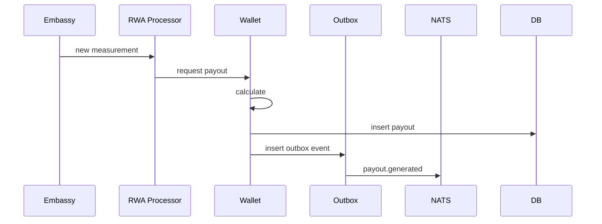
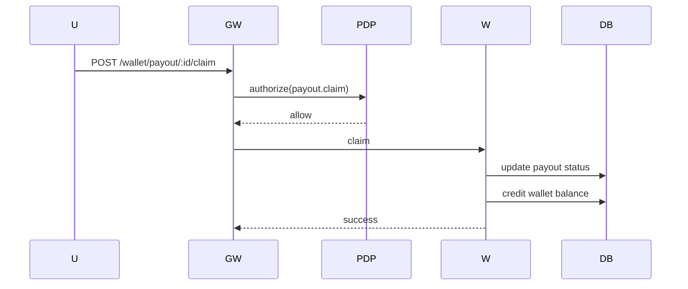

# 49 — Wallet, RWA, Payouts & Claims (MicroDAO)

*Архітектура Wallet Service: баланси, RWA-нарахування, KWT/1T економіка, payout-и, claims, ACL, подвійна верифікація, безпека.*

---

## 1. Purpose & Scope

Документ визначає:

- модель гаманця (Wallet Service),
- токени, що підтримуються,
- RWA → KWT / 1T нарахування,
- payouts та claims,
- ACL для гаманця,
- інтеграцію з RWA, Embassy, Usage Engine, Governance.

Це економічний центр системи DAARION.

---

## 2. Wallet Tokens

### 2.1 1T Token

- внутрішній compute токен
- витрачається на LLM, agents, tools, router
- mint: Governance (policy-based)
- burn: Usage (auto)

### 2.2 KWT Token

- внутрішній енергетичний токен
- нараховується за kWh
- використовується на оплату енергетичних сервісів
- рідко витрачається на compute
- може бути конвертований у 1T (governance-defined)

### 2.3 RINGK Token

- stake token
- збільшує квоти
- впливає на governance
- не витрачається на compute

### 2.4 DAARION Token

- governance token
- використовується у голосуваннях
- не впливає на usage
- може бути конвертований у RINGK

---

## 3. Wallet Architecture

```text
API Gateway (PEP)
     ↓
   PDP
     ↓
 Wallet Service
     ↓
Postgres + NATS Events
```

Wallet обробляє:

- read балансів
- записи payout
- claims
- внутрішні транзакції між командами
- audit логування

---

## 4. Wallet Schema

### 4.1 Balances

```sql
create table wallet_balances (
  id text primary key,
  owner_type text,             -- user|team
  owner_id text,
  symbol text,                 -- 1T|KWT|RINGK|DAARION
  balance numeric,
  updated_at timestamptz
);
```

---

### 4.2 Transactions

```sql
create table wallet_transactions (
  id text primary key,
  owner_type text,
  owner_id text,
  symbol text,
  amount numeric,
  direction text,              -- credit|debit
  reason text,
  ref text,
  ts timestamptz
);
```

---

### 4.3 Payouts

```sql
create table payouts (
  id text primary key,
  team_id text,
  symbol text,                 -- KWT|1T
  amount numeric,
  rwa_ref text,                -- reference to rwa_inventory
  status text,                 -- generated|claimed|failed
  created_at timestamptz,
  claimed_at timestamptz
);
```

---

## 5. ACL Rules

### Wallet Access

| Action          | Roles Allowed               |
| --------------- | --------------------------- |
| view balances   | owner, guardian             |
| claim payouts   | owner, guardian             |
| send tx         | owner                       |
| convert tokens  | owner                       |
| read audit      | owner, guardian             |
| no agent access | agents cannot read balances |

Agent run **не може**:

- бачити баланси
- робити payouts
- робити транзакції

---

## 6. RWA → Payout Formula

### 6.1 ENERGY → KWT

```text
delta_kwh = inventory.delta
payout = delta_kwh × conversion_rate_energy_kwt
```

### 6.2 FOOD → 1T

```text
delta_kg × conversion_rate_food_1t
```

### 6.3 WATER → 1T або KWT

```text
delta_m3 × water_reward_rate (1T/KWT)
```

Conversion rates задає Governance.

---

## 7. Payout Lifecycle



---

## 8. Claim Lifecycle

Owner/Guardian може забрати payout:



---

## 9. Conversion Rules

Команда може конвертувати:

### KWT → 1T

- курс визначає Governance
- зазвичай 1:1 або 1:0.85
- обмеження на денний об'єм

### DAARION → RINGK

- тільки за рішенням governance
- збільшує stake

### RINGK → 1T

- неможливо (односторонній стейк)

---

## 10. Daily/Monthly Limits

Wallet Service накладає ліміти:

- max claims/day
- max tx/day
- max conversion/day
- max payout value/day

---

## 11. Fraud Protection

Wallet блокує:

- подвійні claims
- негативний баланс
- підозрілі великі нарахування
- конфлікт даних з RWA
- повторні RWA-події з однаковим timestamp
- підміну site_id

---

## 12. Governance Controls

Governance може:

- встановлювати conversion rates
- встановлювати max rewards/day
- коригувати max payout
- вимикати reward-и на певний період
- включати emergency freeze
- контролювати стейк RINGK

---

## 13. Integrations

### 13.1 NATS Events

Wallet генерує:

- `wallet.balance.updated`
- `wallet.tx.sent`
- `payout.generated`
- `payout.claimed`

### 13.2 Usage Engine

Wallet використовує Usage Engine для billing за:

- claims
- tx
- conversion

### 13.3 PDP

Кожна дія в гаманці → PDP(authorize).

---

## 14. Transparency & Logs

Wallet зберігає audit trail:

- хто зробив claim
- коли
- з якого IP/device
- які payout-и пов'язані
- які RWA-дані були використані

---

## 15. Example Scenarios

### 15.1 Енергія

Команда виробила 250 kWh → payout=250 KWT.

### 15.2 Вода

Очистка 1 m³ → 1T payout.

### 15.3 Конвертація

Owner конвертує 100 KWT → 80 1T.

### 15.4 Claim

Owner забирає payout → баланс додається → статус "claimed".

---

## 16. Integration with Other Docs

Цей документ доповнює:

- `40_rwa_energy_food_water_flow_specs.md`
- `28_flows_wallet_embassy_energy_union.md`
- `32_policy_service_PDP_design.md`
- `44_usage_accounting_and_quota_engine.md`
- `48_teams_access_control_and_confidential_mode.md`

---

## 17. Завдання для Cursor

```text
You are a senior backend engineer. Implement Wallet, RWA, Payouts & Claims using:
- 49_wallet_rwa_payouts_claims.md
- 40_rwa_energy_food_water_flow_specs.md
- 28_flows_wallet_embassy_energy_union.md

Tasks:
1) Create Wallet Service architecture (API Gateway → PDP → Wallet Service → Postgres + NATS).
2) Define Wallet Tokens (1T, KWT, RINGK, DAARION) with properties.
3) Create Wallet Schema (wallet_balances, wallet_transactions, payouts tables).
4) Implement ACL Rules (view balances, claim payouts, send tx, convert tokens, read audit, no agent access).
5) Implement RWA → Payout Formula (ENERGY → KWT, FOOD → 1T, WATER → 1T/KWT).
6) Implement Payout Lifecycle (Embassy → RWA Processor → Wallet → Outbox → NATS).
7) Implement Claim Lifecycle (User → Gateway → PDP → Wallet → DB update).
8) Add Conversion Rules (KWT → 1T, DAARION → RINGK, RINGK → 1T impossible).
9) Implement Daily/Monthly Limits (max claims/day, max tx/day, max conversion/day, max payout value/day).
10) Add Fraud Protection (double claims, negative balance, suspicious large credits, RWA data conflicts, duplicate RWA events, site_id tampering).
11) Add Governance Controls (conversion rates, max rewards/day, max payout, reward disabling, emergency freeze, RINGK stake control).
12) Integrate with NATS Events (wallet.balance.updated, wallet.tx.sent, payout.generated, payout.claimed).
13) Integrate with Usage Engine (billing for claims, tx, conversion).
14) Integrate with PDP (authorize every wallet action).
15) Add Transparency & Logs (audit trail: who, when, IP/device, related payouts, RWA data used).

Output:
- list of modified files
- diff
- summary
```

---

## 18. Summary

Wallet Service:

- веде баланси 1T/KWT/RINGK/DAARION
- керує payout-и за RWA
- забезпечує claim-и
- інтегрований з Embassy/RWA/Outbox/NATS
- має строгі ACL
- забезпечує прозору економічну модель
- є фундаментальним компонентом DAARION OS

---

**Версія:** 1.0  
**Останнє оновлення:** 2024-11-14


